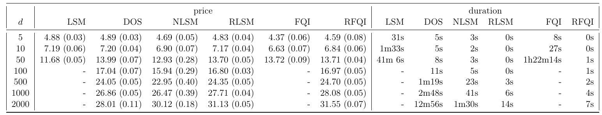

Keywords: optimal stopping, least squares Monte Carlo, reinforcement learning, randomized neural networks, reservoir computing, Greeks of American options

\section{Introduction}

The optimal stopping problem consists in finding the optimal time to stop in order to maximize an expected reward. This problem is found in areas of statistics, economics, and in financial mathematics. Despite significant advances, it remains one of the most challenging problems in optimization, in particular when more than one factor affects the expected reward. A common provable and widely used approach is based on Monte Carlo simulations, where the stopping decision is estimated via backward induction (Tsitsiklis and Van Roy, 2001; Longstaff and Schwartz, 2001), which is an (approximate) dynamic programming approach. Another provable approach is based on reinforcement learning (RL) (Tsitsiklis and Van Roy, 1997, 2001; Yu and Bertsekas, 2007; Li et al., 2009; Chen et al., 2020). Both approaches are based on the ordinary least squares approximation which involves choosing basis functions. There are many different sets of basis functions available that are commonly used, however, it can be difficult to choose a good set for the considered problem. Moreover, the number of basis functions often increases polynomially or even exponentially (Longstaff and Schwartz, 2001, Section 2.2) in the dimension of the underlying process, making those algorithms impractical for high dimensions.

A relatively new approach consists in replacing the basis functions by a neural network and performing gradient descent instead of ordinary least squares (Kohler et al., 2010; Lapeyre and Lelong, 2021; Becker et al., 2019, 2020). The big advantage is that the basis functions do not need to be chosen but are learned instead. Compared to using a polynomial basis, neural networks have the advantage to be dense in any space $L^{p}(\mu)$, for $1 \leq p<\infty$ and finite measure $\mu$ (Hornik, 1991), while for polynomials this is only true under certain additional conditions on the measure (Bakan, 2008). Moreover, in many cases the neural network overcomes the curse of dimensionality, which means that it can easily scale to high dimensions. However, as the neural network is a non convex function with respect to its parameters, the gradient descent does not necessarily converge to the global minimum, while this is the case for the ordinary least squares minimization. Hence, the main disadvantage of those methods is that there are no convergence guarantees without strong and unrealistic assumptions.

In this paper, we propose two neural network based algorithms to solve the optimal stopping problem for Markovian settings: a backward induction and a reinforcement learning approach. The idea is inspired by randomized neural networks (Cao et al., 2018; Huang et al., 2006). Instead of learning the parameters of all layers of the neural network, those of the hidden layers are randomly chosen and fixed and only the parameters of the last layer are learned. Hence, the non convex optimization problem is reduced to a convex problem that can be solved with linear regression. The hidden layers form random feature maps, which can be interpreted as random basis functions. In particular, in this paper we show that there is actually no need for complicated or a large number of basis functions. Our algorithms are based on the methods proposed by Longstaff and Schwartz (2001) (backwardinduction approach) and Tsitsiklis and Van Roy (2001) (reinforcement learning approach). The difference is that we use a randomized neural network instead of a linear combination of basis functions. However, a randomized neural network can also be interpreted as a linear combination of random basis functions. On the other hand, our algorithms can also be interpreted as the neural network extensions of these methods, where not the entire neural network but only the last layer is trained.

In addition, we provide a randomized recurrent neural network approach for nonMarkovian settings. We compare our algorithms to the most relevant baselines in terms of accuracy and computational speed in different option pricing problems. With only a fraction of trainable parameters compared to existing methods, we achieve high quality results considerably faster.

\section{Optimal Stopping via Randomized Neural Networks}

One of the most popular and most studied applications of optimal stopping is the pricing of American options. Hence, we explain our approach in this context.

\subsection{American and Bermudan Options}

An American option gives the holder the right but not the obligation to exercise the option associated with a non-negative payoff function $g$ at any time up to the maturity. An American option can be approximated by a Bermudan option, which can be exercised only at some specific dates $t_{0}<t_{1}<t_{2}<\cdots<t_{N}$, transforming the continuous-time problem to a discrete one. If the time grid is chosen small enough, the American option is well approximated by the Bermudan option. In the case of a Rough Heston model, the convergence rate of the Bermudan option price to the American option price was shown in (Chevalier et al., 2021, Theorem 4.2). For equidistant dates we simply write $0,1,2, \ldots, N$ instead of $t_{0}<t_{1}<t_{2}<\cdots<t_{N}$.

\subsection{Option Price and Optimal Stopping.}

For $d \in \mathbb{N}$, we assume to have a $d$-dimensional Markovian stochastic process $\left(X_{t}\right)_{t \geq 0}$ describing the stock prices. With respect to a fixed (pricing) probability measure $\mathbb{Q}$, the (superhedging seller's) price of the discretized American option can be expressed through the Snell envelope described by

$$
\begin{aligned}
U_{N} & :=g\left(X_{N}\right), \\
U_{n} & :=\max \left(g\left(X_{n}\right), \mathbb{E}\left[\alpha U_{n+1} \mid X_{n}\right]\right), \quad 0 \leq n<N,
\end{aligned}
$$

where $\alpha$ is the step-wise discounting factor and $g\left(X_{n}\right)$ is assumed to be square integrable for all $n$. Then the (superhedging seller's) price of the option at time $n$ is given by $U_{n}$ and can equivalently be expressed as the optimal stopping problem

$$
U_{n}=\sup _{\tau \in \mathcal{T}_{n}} \mathbb{E}\left[\alpha^{\tau-n} g\left(X_{\tau}\right) \mid X_{n}\right],
$$

where $\mathcal{T}_{n}$ is the set of all stopping times $\tau \geq n$. The smallest optimal stopping time is given by

$$
\begin{aligned}
\tau_{N} & :=N, \\
\tau_{n} & := \begin{cases}n, & \text { if } g\left(X_{n}\right) \geq \mathbb{E}\left[\alpha U_{n+1} \mid X_{n}\right], \\
\tau_{n+1}, & \text { otherwise. }\end{cases}
\end{aligned}
$$

In particular, at maturity $N$, the holder receives the final payoff, and the value of the option $U_{N}$ is equal to the payoff $g\left(X_{N}\right)$. At each time prior to the maturity, the holder decides whether to exercise or not, depending on whether the current payoff $g\left(X_{n}\right)$ is greater than the continuation value $c_{n}\left(X_{n}\right):=\mathbb{E}\left[\alpha U_{n+1} \mid X_{n}\right]$. Combining expression (1), (2) and (3), we can write the price at initial time as

$$
U_{0}=\max \left(g\left(X_{0}\right), \mathbb{E}\left[\alpha^{\tau_{1}} g\left(X_{\tau_{1}}\right)\right]\right) .
$$

In the following we approximate the price $U_{0}$ and continuation values $c_{n}\left(X_{n}\right)$ which are defined theoretically but cannot be computed directly.

\subsection{Monte Carlo Simulation and Backward Recursion}

We assume to have access to a procedure to sample discrete paths of $X$ under $\mathbb{Q}$. A standard example is that $X$ follows a certain stochastic differential equation (SDE) with known parameters. Therefore, we can sample $m$ realizations of the stock price paths, where the $i$-th realization is denoted by $x_{0}, x_{1}^{i}, x_{2}^{i}, \ldots, x_{N}^{i}$, with the fixed initial value $x_{0}$. For each realization, the cash flow realized by the holder when following the stopping strategy (3) is given by the backward recursion

$$
\begin{aligned}
p_{N}^{i} & :=g\left(x_{N}^{i}\right), \\
p_{n}^{i} & := \begin{cases}g\left(x_{n}^{i}\right), & \text { if } g\left(x_{n}^{i}\right) \geq c_{n}\left(x_{n}^{i}\right) \\
\alpha p_{n+1}^{i}, & \text { otherwise }\end{cases}
\end{aligned}
$$

As $p_{1}^{i}$ are samples of $\alpha^{\tau_{1}-1} g\left(X_{\tau_{1}}\right)$, we have by the strong law of large numbers that almost surely

$$
U_{0}=\max \left(g\left(X_{0}\right), \lim _{m \rightarrow \infty} \frac{1}{m} \sum_{i=1}^{m} \alpha p_{1}^{i}\right)
$$

\subsection{Randomized Neural Network Approximation of the Continuation Value}

For each path $i$ in $\{1,2, \ldots, m\}$ and each date $n$ in $\{1,2, \ldots, N-1\}$, the continuation value is $c_{n}\left(x_{n}^{i}\right)=\mathbb{E}\left[\alpha U_{n+1} \mid X_{n}=x_{n}^{i}\right]$, where $c_{n}: \mathbb{R}^{d} \rightarrow \mathbb{R}$ describes the expected value of the discounted price $\alpha U_{n+1}$ if we keep the option until next exercising date $n+1$, knowing the current values of the stocks $X_{n}$. We approximate this continuation value function by a neural network, where only the parameters of the last layer are learned. We refer to such a network as a randomized neural network. Even though the architecture of the neural network can be general, we present our algorithm with a simple dense shallow neural network, where the extension to deep networks is immediate. We call $\sigma: \mathbb{R} \rightarrow \mathbb{R}$ the activation function. A common choice is $\boldsymbol{\sigma}(x)=\tanh (x)$, however, there are many other suitable alternatives. For $K \in \mathbb{N}$, we define $\sigma: \mathbb{R}^{K-1} \rightarrow \mathbb{R}^{K-1}, \sigma(x)=\left(\boldsymbol{\sigma}\left(x_{1}\right), \ldots, \boldsymbol{\sigma}\left(x_{K-1}\right)\right)^{\top}$ for $x \in \mathbb{R}^{K-1}$. Let $\vartheta:=(A, b) \in \mathbb{R}^{(K-1) \times d} \times \mathbb{R}^{K-1}$ be the parameters of the hidden layer which are randomly and identically sampled and not optimized. In general, $A$ and $b$ can be sampled from different distributions that are continuous and cover all of $\mathbb{R}$. The distributions and their parameters are hyperparameters of the randomized neural network that can be tuned. For simplicity we use a standard Gaussian distribution. Let us define

$$
\phi: \mathbb{R}^{d} \rightarrow \mathbb{R}^{K}, x \mapsto \phi(x)=\left(\sigma(A x+b)^{\top}, 1\right)^{\top} .
$$

and let $\theta_{n}:=\left(\left(A_{n}\right)^{\top}, b_{n}\right) \in \mathbb{R}^{K-1} \times \mathbb{R}$ be the parameters that are optimized. Then for each $n$ the continuation value is approximated by

$$
c_{\theta_{n}}(x):=\theta_{n}^{\top} \phi(x)=A_{n}^{\top} \sigma(A x+b)+b_{n} .
$$

\subsection{Least Squares Optimization of Last Layer's Parameters $\theta_{n}$}

While the parameters $\vartheta$ of the hidden layer are set randomly, the parameters $\theta_{n}$ of the last layer are found by minimizing the squared error of the difference between conditional expectation of the discounted future price and the approximation function. This is equivalent to finding $\theta_{n}$ which minimizes $\mathbb{E}_{\mathbb{Q}}\left[\left(c_{\theta_{n}}\left(x_{n}^{i}, n\right)-\alpha U_{n+1}\right)^{2} \mid X_{n}=x_{n}^{i}\right]$ for each time $n$ in $\{1,2, \ldots, N-1\}$. The backward recursive Monte Carlo approximation of this expectation at time $n$ yields the loss function

$$
\psi_{n}\left(\theta_{n}\right)=\sum_{i=1}^{m}\left(c_{\theta_{n}}\left(x_{n}^{i}\right)-\alpha p_{n+1}^{i}\right)^{2} .
$$

As the approximation function $c_{\theta_{n}}$ is linear in the parameters $\theta_{n}$, the minimizer can be found by ordinary least squares. It is given by the following closed form expression, which is well defined under the standard assumptions (see Theorems 5 and 6 )

$$
\theta_{n}=\alpha\left(\sum_{i=1}^{m} \phi\left(x_{n}^{i}\right) \phi^{\top}\left(x_{n}^{i}\right)\right)^{-1} \cdot\left(\sum_{i=1}^{m} \phi\left(x_{n}^{i}\right) p_{n+1}^{i}\right) .
$$

\subsection{Splitting the Data Set into Training and Evaluation Set}

The parameters $\theta_{n}$ are determined using $50 \%$ of the sampled paths (training data). Given $\theta_{n}$, the remaining $50 \%$ of the sampled paths (evaluation data) are used to compute the option price. By definition, the continuation value $c_{n}$ is a conditional expectation, which is not allowed to depend on the future values $X_{n+1}$. If the data set was not split, this might not be satisfied, since the loss function (5) uses the future values $X_{n+1}$. In particular, the neural network can suffer from overfitting to the training data, by memorizing the paths, instead of learning the continuation value. This is related to the maximization bias discussed in (Sutton and Barto, 2018, Section 6.7).

\subsection{Algorithm}

We first sample $2 m$ paths and then proceed backwards as follows. At maturity, the pathwise option price approximation is equal to the payoff, which means that $p_{N}^{i}=g\left(x_{N}^{i}\right)$. For each time $n$ in $\{N-1, N-2, \ldots, 0\}$, we first determine $\theta_{n}$ as described before using the paths $\{1,2, \ldots, m\}$. For all paths $i \in\{1,2, \ldots, 2 m\}$ we then compare the exercise value $g\left(x_{n}^{i}\right)$ to the continuation value $c_{\theta_{n}}\left(x_{n}^{i}\right)$ and determine the path-wise option price approximation at time $n$ as

$$
p_{n}^{i}=\underbrace{g\left(x_{n}^{i}\right)}_{\text {payoff }} \underbrace{\mathbf{1}_{\left\{g\left(x_{n}^{i}\right) \geq c_{\theta}\left(x_{n}^{i}\right)\right\}}}_{\text {exercise }}+\underbrace{\alpha p_{n+1}^{i}}_{\text {discounted future price }} \underbrace{\mathbf{1}_{\left\{g\left(x_{n}^{i}\right)<c_{\theta}\left(x_{n}^{i}\right)\right\}}}_{\text {continue }} .
$$

Finally, the second half of the paths $\{m+1, \ldots, 2 m\}$ is used to compute the option price approximation $p_{0}=\max \left(g\left(x_{0}\right), \frac{1}{m} \sum_{i=m+1}^{2 m} \alpha p_{1}^{i}\right)$. We call this algorithm, which is presented in Algorithm 1, randomized least squares Monte Carlo (RLSM).

Algorithm 1 Optimal stopping via randomized least squares Monte Carlo (RLSM)

Input: discount factor $\alpha$, initial value $x_{0}$

Output: price $p_{0}$

1: sample a random matrix $A \in \mathbb{R}^{(K-1) \times d}$ and a random vector $b \in \mathbb{R}^{K-1}$

2: simulate $2 m$ paths of the underlying process $\left(x_{1}^{i}, \ldots, x_{N}^{i}\right)$ for $i \in\{1, \ldots, 2 m\}$

3: for each path $i \in\{1, \ldots, 2 m\}$, set $p_{N}^{i}=g\left(x_{N}^{i}\right)$

4: for each time $n \in\{N-1, \ldots, 1\}$

a: for each path $i \in\{1, \ldots, 2 m\}$, set $\phi\left(x_{n}^{i}\right)=\left(\sigma\left(A x_{n}^{i}+b\right)^{\top}, 1\right)^{\top} \in \mathbb{R}^{K}$

b: set $\theta_{n}=\alpha\left(\sum_{i=1}^{m} \phi\left(x_{n}^{i}\right) \phi^{\top}\left(x_{n}^{i}\right)\right)^{-1}\left(\sum_{i=1}^{m} \phi\left(x_{n}^{i}\right) p_{n+1}^{i}\right)$

c: for each path $i \in\{1, \ldots, 2 m\}$, set $p_{n}^{i}=g\left(x_{n}^{i}\right) \mathbf{1}_{g\left(x_{n}^{i}\right) \geq \theta_{n}^{\top} \phi\left(x_{n}^{i}\right)}+\alpha p_{n+1} \mathbf{1}_{g\left(x_{n}^{i}\right)<\theta_{n}^{\top} \phi\left(x_{n}^{i}\right)}$

5: set $p_{0}=\max \left(g\left(x_{0}\right), \frac{1}{m} \sum_{i=m+1}^{2 m} \alpha p_{1}^{i}\right)$

\subsection{Guarantees of Convergence}

We present results that guarantee convergence of the price computed with our algorithm to the correct price of the discretized American option. The formal results with precise definitions and proofs are given in Section A. In contrast to comparable results for neural networks (Lapeyre and Lelong, 2021; Becker et al., 2019, 2020), our results do not need the assumption that the optimal weights are found by some optimization scheme like stochastic gradient descent. Instead, our algorithms imply that the optimal weights are found and used.

Theorem 1 (informal). As the number of sampled paths $m$ and the number of random basis functions $K$ go to $\infty$, the price $p_{0}$ computed with Algorithm 1 converges to the correct price of the Bermudan option.

\subsection{Possible Extensions}

When the set of pricing measures $\mathcal{Q}$ has more than one element (in case of an incomplete market), the option price is given by $\sup _{\mathbb{Q} \in \mathcal{Q}} U_{0}^{\mathbb{Q}}$, where $U^{\mathbb{Q}}$ is defined as in (1). Assuming that we can sample from a finite subset $\mathcal{Q}_{1} \subset \mathcal{Q}$, this price can be approximated by first computing the price for each measure in $\mathcal{Q}_{1}$ and taking the maximum of them.

For simplicity we assume that the payoff function only takes the current price as input, however, all our methods and results stay valid if $g\left(X_{n}\right)$ is replaced by a square integrable $\mathcal{F}_{n}$-measurable random variable $Z_{n}$, where $\mathcal{F}_{n}$ denotes the information available up to time $n$. In the case that $\left(Z_{n}\right)_{1 \leq n \leq N}$ is Markov, Algorithm 1 and Algorithm 2 (Section 3) can be used, otherwise Algorithm 3 (Section 4) has to be used, to deal with the path dependence. In the following sections we stick to the notation $g\left(X_{n}\right)$ for the payoff, keeping in mind that the extension to a general $Z_{n}$ is also valid there.

\section{Optimal Stopping via Randomized Reinforcement Learning}

In order to avoid approximating the continuation value at each single date $n \in\{1, \ldots, N-1\}$ with a different function, as it is done in Section 2, we can directly learn the continuation function which also takes the time as argument. Hence, instead of having a different function $c_{\theta_{n}}\left(x_{n}^{i}\right)$ for each date $n$, we learn one function which is used for all dates $n$. As previously, we define $\vartheta:=(A, b) \in \mathbb{R}^{(K-1) \times(d+2)} \times \mathbb{R}^{K-1}$ the parameters of the hidden layer which are randomly chosen and not optimized, and $\phi: \mathbb{R}^{d+2} \rightarrow \mathbb{R}^{K}, \phi(n, x)=\left(\sigma\left(A \tilde{x}_{n}+b\right)^{\top}, 1\right)^{\top}$, where $\tilde{x}_{n}=\left(n, N-n, x_{n}^{\top}\right)^{\top}$. Let $\theta \in \mathbb{R}^{K}$ define the parameters that are optimized, then the continuation value is approximated by

$$
c_{\theta}(n, x)=\theta^{\top} \phi(n, x) .
$$

Instead of having a loop backward in time with $N$ steps, we iteratively improve the approximation $c_{\theta}$. More precisely, we start with some (random) initial weight $\theta_{0}$ and then iteratively improve it by minimizing the difference between the continuation function $c_{\theta_{\ell}}$ and the prices $p$ computed with the previous weight $\theta_{\ell-1}$. Moreover, differently than in Section 2, we use the continuation value for the decision whether to continue and for the approximation of the discounted future price, as in (Tsitsiklis and Van Roy, 2001). This second algorithm can be interpreted as a randomized fitted Q-iteration (RFQI) and is presented in Algorithm 2. It is a very simple type of reinforcement learning, where the agent has only two possible actions and the agent's decision does not influence the transitions of the state. In particular the agent's decision does not influence the evolution of the underlying stocks. As a reinforcement learning method, it is based on the assumption that the optimization problem can be modeled by a Markov decision process. 

\begin{tabular}{l}
\hline Algorithm 2 Optimal stopping via randomized fitted Q-Iteration (RFQI) \\
\hline Input: discount factor $\alpha$, initial value $x_{0}$ \\
Output: price $p_{0}$ \\
1: sample a random matrix $A \in \mathbb{R}^{(K-1) \times(d+2)}$ and a random vector $b \in \mathbb{R}^{K-1}$ \\
2: simulate $2 m$ paths of the underlying process $\left(x_{1}^{i}, \ldots, x_{N}^{i}\right)$ for $i \in\{1, \ldots, 2 m\}$ \\
3: initialize weights $\theta_{0}=0 \in \mathbb{R}^{K}$ and set $\ell=0$ \\
4: until convergence of $\theta_{\ell}$ \\
$\quad$ a: for each path $i \in\{1, \ldots, 2 m\}$ \\
$\quad$ i: set $p_{N}^{i}=g\left(x_{N}^{i}\right)$ \\
$\quad$ ii: for each date $n \in\{1, \ldots, N-1\}$, \\
$\quad \operatorname{set} \phi\left(n, x_{n}^{i}\right)=\left(\sigma\left(A \tilde{x}_{n}^{i}+b\right), 1\right) \in \mathbb{R}^{K}$ \\
$\quad \operatorname{set} p_{n}^{i}=\max \left(g\left(x_{n}^{i}\right), \phi\left(n, x_{n}^{i}\right)^{\top} \theta_{\ell}\right)$ \\
b: set $\theta_{\ell+1}=\alpha\left(\sum_{n=1}^{N} \sum_{i=1}^{m} \phi\left(n, x_{n}^{i}\right) \phi^{\top}\left(n, x_{n}^{i}\right)\right)^{-1} \cdot\left(\sum_{n=1}^{N} \sum_{i=1}^{m} \phi\left(n, x_{n}^{i}\right) p_{n+1}^{i}\right) \in \mathbb{R}^{K}$ \\
c: set $\ell \leftarrow \ell+1$ \\
5: set $p_{0}=\max \left(g\left(x_{0}\right), \frac{1}{m} \sum_{i=m+1}^{2 m} \alpha p_{1}^{i}\right)$ \\
\hline
\end{tabular}

\subsection{Guarantees of Convergence.}

We present results that guarantee convergence of the price computed with our algorithm to the correct price of the discretized American option. The formal results with precise definitions and proofs are given in Section B.

Theorem 2 (informal). As the number of iterations L, the number of sampled paths $m$ and the number of random basis functions $K$ go to $\infty$, the price $p_{0}$ computed with Algorithm 2 converges to the correct price of the Bermudan option.

\section{Optimal Stopping via Randomized Recurrent Neural Networks for Non-Markovian Processes}

For non-Markovian processes, for each date $n$, the continuation function is no longer a function of the last stock price, $c_{n}\left(X_{n}\right)$, but a function depending on the entire history $c_{n}\left(X_{0}, X_{1}, \ldots, X_{n-1}, X_{n}\right)$. More precisely, the continuation value is now defined by $c_{n}:=$ $\mathbb{E}\left[\alpha g\left(X_{n+1}\right) \mid \mathcal{F}_{n}\right]$ where $\mathcal{F}_{n}$ denotes the information available up to time $n$. Therefore, we replace the randomized feed-forward neural network by a randomized recurrent neural network (randomized RNN), which can utilize the entire information of the path up to the current time $\left(x_{0}, x_{1}, \ldots, x_{n-1}, x_{n}\right)$. In particular, we define $\vartheta:=\left(A_{x}, A_{h}, b\right) \in \mathbb{R}^{(K-1) \times d} \times$ $\mathbb{R}^{(K-1) \times(K-1)} \times \mathbb{R}^{K-1}$, the parameters of the hidden layer which are randomly sampled and not optimized. However, their distributions and parameters, which don't have to be the same for $A_{x}$ and $A_{h}$, are hyperparameters that can be tuned. Those tuning parameters are more important in this case, as they determine the interplay between past and new information. Moreover, we define

$$
\phi: \mathbb{R}^{d} \times \mathbb{R}^{K} \rightarrow \mathbb{R}^{K+1}, \quad(x, h) \mapsto \phi(x, h)=\left(\sigma\left(A_{x} x+A_{h} h+b\right)^{\top}, 1\right)^{\top}
$$

and $\theta_{n}:=\left(\left(A_{n}\right)^{\top}, b_{n}\right) \in \mathbb{R}^{K-1} \times \mathbb{R}$, the parameters that are optimized. Then for each $n$, the continuation value is approximated by

$$
\left\{\begin{array}{l}
h_{n}=\sigma\left(A_{x} x_{n}+A_{h} h_{n-1}+b\right) \\
c_{\theta_{n}}\left(h_{n}\right)=A_{n}^{\top} h_{n}+b_{n}=\theta_{n}^{\top} \phi\left(x_{n}, h_{n-1}\right)
\end{array}\right.
$$

with $h_{-1}=0$. We call this algorithm, which is presented in Algorithm 3, randomized recurrent least squares Monte Carlo (RRLSM).

\subsection{Guarantees of Convergence}

We present results that guarantee convergence of the price computed with our algorithm to the correct price of the discretized American option. The formal results with precise definitions and proofs are given in Section C.

Theorem 3 (informal). As the number of sampled paths $m$ and the number of random basis functions $K$ go to $\infty$, the price $p_{0}$ computed with Algorithm 3 converges to the correct price of the Bermudan option.

\section{Related Work}

In this section we present the most relevant approaches for the optimal stopping problem: backward induction either with basis functions or with neural networks and reinforcement learning. Moreover, we explain the connection of our algorithms to randomized neural networks and reservoir computing techniques.

\subsection{Optimal Stopping}

Numerous works studied the optimal stopping problem via different approaches. A common approach consists in using a regression based method to estimate the continuation value (Tilley, 1993; Barraquand and Martineau, 1995; Carriere, 1996; Tsitsiklis and Van Roy, 1997, 2001; Longstaff and Schwartz, 2001; Schweizer, 2002; Boyle et al., 2003; Broadie and Glasserman, 2004; Kolodko and Schoenmakers, 2004; Egloff et al., 2007; Jain and Oosterlee, 2015), or the optimal stopping boundary (Pham, 1997; Andersen, 1999; Garcia, 2003). A different approach uses quantization (Bally and Pagès, 2003; Bally et al., 2005). A dual approach was developed and extended in (Rogers, 2002; Haugh and Kogan, 2004; Rogers, 2010). Bank and Besslich (2019) studied Lenglart's Theory of Meyer-sigma-fields and El Karoui's Theory of Optimal Stopping (El Karoui, 1981). An in depth review of the different methods is given in (Bouchard and Warin, 2012; Pagès, 2018).

\subsubsection{Optimal Stopping Via Backward Induction}

One of the most popular approaches are the backward induction methods introduced by Tsitsiklis and Van Roy (2001) and Longstaff and Schwartz (2001). Tsitsiklis and Van Roy (2001) use the approximated continuation value to estimate the current price, by using the following backward recursion

$$
p_{n}^{i}=\max \left(g\left(x_{n}^{i}\right), c_{\theta_{n}}\left(x_{n}^{i}\right)\right) .
$$

Instead, Longstaff and Schwartz (2001) use the continuation value only for the decision to stop or to continue.

$$
p_{n}^{i}= \begin{cases}g\left(x_{n}^{i}\right), & \text { if } g\left(x_{n}^{i}\right) \geq c_{\theta_{n}}\left(x_{n}^{i}\right) \\ \alpha p_{n+1}^{i}, & \text { otherwise }\end{cases}
$$

The second algorithm is more robust, as the approximation is only used for the decision and not for the estimation of the price. Hence, the method proposed by Longstaff and Schwartz (2001) is the most used method in the financial industry and can be considered state-of-the-art. In both papers, the approximation $c_{\theta}\left(x_{n}^{i}\right)=\theta^{\top} \phi\left(x_{n}^{i}\right)$ is used, where $\phi=\left(\phi_{1}, \ldots, \phi_{K}\right)$ is a set of $K$ basis functions and $\theta \in \mathbb{R}^{K}$ are the trainable weights. Possible choices for the basis functions proposed in Longstaff and Schwartz (2001) are Laguerre, Hermite, Legendre, Chebyshev, Gegenbauer, and Jacobi polynomials. While they have the advantage of having convergence guarantees, both algorithms do not easily scale to high dimensional problems since the number of basis functions usually grows polynomially or even exponentially (Longstaff and Schwartz, 2001, Section 2.2) in the number of stocks. One direction of research to overcome this problem is to apply dimension reduction techniques (Bayer et al., 2021).

\subsubsection{Optimal Stopping via Backward Induction using Neural Networks.}

Another idea to overcome this issue was proposed by Kohler et al. (2010), which consists in approximating the continuation value by a neural network

$$
f_{\theta}\left(x_{n}^{i}\right) \approx c_{\theta}\left(x_{n}^{i}\right) .
$$

That way, the features are learned contrary to the basis functions which must be chosen. While Kohler et al. (2010) use the backward recursion (7) introduced by Tsitsiklis and Van Roy (2001), both Lapeyre and Lelong (2021) and Becker et al. (2020) use the backward recursion (8) suggested by Longstaff and Schwartz (2001). Instead of approximating the continuation value, Becker et al. (2019) suggested to approximate the whole indicator function presented in $(8)$ by a neural network $f_{\theta_{n}}\left(x_{n}^{i}\right) \approx \mathbf{1}_{\left\{g\left(x_{n}^{i}\right) \geq c\left(x_{n}^{i}\right)\right\}}$. Therefore the current price can be estimated by

$$
p_{n}^{i}=g\left(x_{n}^{i}\right) \underbrace{f_{\theta_{n}}\left(x_{n}^{i}\right)}_{\text {stop }}+\alpha p_{n+1}^{i} \underbrace{\left(1-f_{\theta_{k}}\left(x_{n}^{i}\right)\right)}_{\text {continue }} .
$$

Moreover, instead of minimizing the loss function (5) in order to find a good approximation of the continuation function, Becker et al. (2019) optimize the parameters by directly maximizing the option price $\psi_{n}\left(\theta_{n}\right)=\frac{1}{m} \sum_{i=1}^{m} \alpha p_{n}^{i}$.

All those methods use a stochastic gradient based method to optimize the parameters of the neural networks. They have to find the parameters of $N-1$ neural networks (using a different neural network for each date). Since they use stochastic gradient methods with a non-convex loss function they cannot provide theoretical convergence guarantees, without the strong assumption that they find the optimal parameters.

\subsubsection{Optimal Stopping Via Reinforcement Learning}

By its nature, reinforcement learning is closely related to the dynamic programming principle as shown in (Sutton and Barto, 2018; Bertsekas and Tsitsiklis, 1996). Moreover the optimal stopping problem is well studied as an application of reinforcement learning (Tsitsiklis and Van Roy, 1997, 2001; Yu and Bertsekas, 2007; Li et al., 2009). In all those methods, a linear approximator is used (linear combination of basis functions), similarly to the LSM method (Longstaff and Schwartz, 2001). If a standard set of basis functions that grows polynomially in the dimension is used, then these methods suffer from the curse of dimensionality. In particular, they cannot practically be scaled to high dimensions as can be seen in our numerical results. To the best of our knowledge, our approach constitutes the first time that randomized neural networks are used to approximate the value function in reinforcement learning.

\subsection{Randomized Neural Networks and Reservoir Computing}

In RLSM and RFQI we use a neural network with randomly sampled and fixed hidden layers, where only the last layer is reinitialized and trained at each time $n \in\{N-1, \ldots, 1\}$. The architecture used at each time can be interpreted as a neural network with random weights (NNRW) studied and reviewed in (Cao et al., 2018), where a universality result was provided in (Huang et al., 2006). Randomized neural networks as approximation functions were also studied by Gorban et al. (2016).

Randomized recurrent neural networks are an extension of randomized neural networks. A recurrent neural network (RNN) where the parameters are randomly generated and fixed and only the readout map is trained, is known as reservoir. Reservoir computing not only reduces the computation time, but also outperforms classical fully trained RNNs in many tasks (Schrauwen et al., 2007; Verstraeten et al., 2007; Lukoševičius and Jaeger, 2009; Gallicchio et al., 2017). Similarly as in reservoir computing, in our randomized recurrent neural network algorithm RRLSM the parameters of the hidden layers are randomly sampled and fixed thereafter. However, while reservoir computing trains only one readout map which has the same parameters for all times, we train a different readout map for each single time $n \in\{N-1, \ldots, 1\}$ similarly to RLSM.

\subsection{Backward Induction versus Reinforcement Learning}

Backward induction is an (approximate) dynamic programming (ADP) approach. While Sutton and Barto (2018) regard ADP as a class of RL algorithms, we distinguish these two approaches in this work, because of their different algorithmic structure and their different ways of using the training data. In particular, backward recursion computes the approximation of the continuation value for each date sequentially. More precisely, it starts at the final date and goes backward in time. For the approximation at each date, only the data of this date is used. In contrast to this, RL starts with an initial approximation that is applied for all dates and iteratively improves this approximation. This way, the data of all dates is used to improve the approximation of all dates. In comparison to backward recursion, this can be interpreted as a type of transfer learning between the dates.

\section{Experiments}

There are numerous ways to empirically evaluate optimal stopping approaches. Therefore, we choose the most studied settings that were considered in the American option pricing literature. In particular, we only consider synthetic data. Applications to real data involve model calibration which is an independent problem and finally results in applying the optimal stopping algorithm to synthetically generated data again.

Besides our algorithms, we also implemented the baselines and provided all of them at https://github.com/HeKrRuTe/OptStopRandNN.

\subsection{Experimental Setup}

The evaluation of all the algorithms was done on the same computer, a dedicated machine with $2 \times$ Intel Xeon CPU E5-2697 v2 (12 Cores) $2.70 \mathrm{GHz}$ and $256 \mathrm{GiB}$ of RAM.

\subsubsection{Baselines (LSM, NLSM, DOS And FQI)}

We compare RLSM and RFQI to three backward induction algorithms and one reinforcement learning approach. First, the state-of-the-art least squares Monte Carlo (LSM) (Longstaff and Schwartz, 2001). Second, the algorithm proposed by Lapeyre and Lelong (2021), where the basis functions are replaced by a deep neural network (NLSM). Third, the deep optimal stopping (DOS) (Becker et al., 2019), where instead of the continuation value the whole indicator function of the stopping decision is approximated by a neural network. Finally, the fitted Q-iteration (FQI) presented as the second algorithm in (Tsitsiklis and Van Roy, 1997). Li et al. (2009) studied and compared two reinforcement learning based methods (FQI and LSPI) to solve the optimal stopping problem. Since FQI always worked better in our experiments, we only show comparisons to this algorithm. Our aim is to compare the main concepts of all the different algorithms in a fair way, hence we leave away certain (more sophisticated) particularities unique to each of them. 

\subsubsection{Choice of Basis Functions for the Baselines}

There are many possible choices for the set of basis functions. Longstaff and Schwartz (2001) proposed to use the first three weighted Laguerre polynomials for LSM and Li et al. (2009) added three additional basis functions of the date for FQI. While the size of this set of basis functions scales linearly with the dimension, it does not include any interaction terms. The classical polynomial basis functions up to the second order are the easiest way to include coupling terms in the basis. To deal with the time dependence of FQI, the relative date $t / T$ and $1-t / T$ are added as additional coordinates to the $d$-dimensional stock vector. The size of this basis grows quadratically in the dimension $d$, i.e. it has $1+2 d+d(d-1) / 2$ elements for LSM and for FQI $d$ is replaced by $d+2$. The results obtained with the classical polynomials up to degree two were better than with the weighted Laguerre polynomials for LSM and FQI, therefore we only present these results in our Tables. For large $d$ the computations of LSM and FQI did not terminate within a reasonable amount of time (several hours) and therefore were aborted.

\subsubsection{No Regularization for LSM And FQI}

While increasing the number of hidden nodes without applying penalization led to overfitting for RLSM and RFQI , this was not observed for LSM and FQI. In particular, for LSM Ridge regression ( $L^{2}$-penalisation) was tested without leading to better results than standard linear regression. Moreover, comparing the results of FQI, RFQI and DOS for growing dimensions shows that overfitting does not become a problem when more basis functions are used. Therefore, also for FQI standard linear regression was used as suggested by Tsitsiklis and Van Roy (1997).

\subsubsection{Architecture of Neural Networks}

In order to have a fair comparison in terms of accuracy and in terms of computation time, we use the same number of hidden layers and nodes per layer for all the algorithms.

- As we observed that one hidden layer was sufficient to have a good accuracy (an increase of the number of the hidden layers did not lead to better accuracy), we use one hidden layer. Therefore, NLSM, DOS, and all algorithms that we proposed have only one hidden layer.

- We use 20 nodes for the hidden layer. For RFQI the number of nodes is set to the minimum between 20 and the number of stocks for stability reasons.

- Leaky ReLU is used for RLSM and RFQI and tanh for the randomized recurrent neural network RRLSM. For NLSM and DOS, we use the suggested activation functions, Leaky ReLU for NLSM and ReLU and sigmoid for DOS.

- The parameters $(A, b)$ of the random neural networks of RLSM and RFQI are sampled using a standard normal distribution with mean 0 and standard deviation 1 . Different hyper-parameters were tested, but they didn't have a big influence on the results so we kept the standard choice. - For the randomized recurrent neural network of RRLSM, we use a standard deviation of $0.0001$ for $A_{x}$ and $0.3$ for $A_{h}$. Also here different hyper-parameters were tested, and the best performing were chosen and used to present the results. The same holds for tested path-dependent versions of RFQI , however, none of the hyper-parameters performed very well as shown below.

- Some of the reference methods suggest to use the payoff as additional input, while others do not or leave this open. Therefore, we tested using the payoff as input and not using it for each method in each experiment. We came to the conclusion that the backward induction algorithms (LSM, DOS, NLSM, RLSM) usually work slightly better with, while the reinforcement learning algorithms (FQI, RFQI) usually work slightly better without the payoff. Hence, we show these results.

- As suggested by the authors, we used batch normalization for the implementation of DOS.

\subsection{The Markovian Case - Bermudan Option Pricing}

First we evaluate RLSM and RFQI in the standard Markovian setting of Bermudan option pricing with different stock price models and payoff functions.

\subsubsection{Stock Models (Black-Scholes and Heston)}

We test our algorithm on two multidimensional stochastic models, Black-Scholes and Heston with fixed parameters. For each model we sample $m=20^{\prime} 000$ paths on the time interval $[0,1]$ using the Euler-scheme with $N=10$ equidistant dates. As explained in Section 2.6, we use half of the paths as training set and the second half to compute the approximated price using the trained continuation value respectively decision function.

The Black-Scholes model for a max call option is a widely used example in the literature (Longstaff and Schwartz, 2001; Lapeyre and Lelong, 2021; Becker et al., 2019). The Stochastic Differential Equation (SDE) describing this model is

$$
d X_{t}=(r-\delta) X_{t} d t+\sigma X_{t} d W_{t}
$$

with $X_{0}=x_{0}$ where $\left(W_{t}\right)_{t \geq 0}$ is a $d$-dimensional Brownian motion. If not stated differently, we choose the rate $r=0 \%$, the dividend rate $\delta=0 \%$, the volatility $\sigma=20 \%$ and the initial stock price $x_{0} \in\{80,100,120\}$.

To increase the complexity, we also compare the algorithms on the Heston model (Heston, 1993), which is also used in (Lapeyre and Lelong, 2021). The SDE describing this model is

$$
\begin{aligned}
d X_{t} & =(r-\delta) X_{t} d t+\sqrt{v_{t}} X_{t} d W_{t}, \\
d v_{t} & =-\kappa\left(v_{t}-v_{\infty}\right) d t+\sigma \sqrt{v_{t}} d B_{t}
\end{aligned}
$$

with $X_{0}=x_{0}$ and $v_{0}=\nu_{0}$, where $\left(W_{t}\right)_{t \geq 0}$ and $\left(B_{t}\right)_{t \geq 0}$ are two $d$-dimensional Brownian motions correlated with coefficient $\rho \in(-1,1)$. Here, $X$ is the stock price and $v$ the stochastic variance process. If not stated differently, we choose the drift $r=0 \%$, the dividend rate $\delta=0 \%$, the volatility of volatility $\sigma=20 \%$, the long term variance $v_{\infty}=0.01$, the mean reversion speed $\kappa=2$, the correlation $\rho=-30 \%$, the initial stock price $x_{0}=100$ and the initial variance $\nu_{0}=0.01$. Since the Heston model is Markovian only if the price and the variance $\left(X_{t}, v_{t}\right)$ are observed simultaneously, we give both values as inputs to the algorithms here, and denote this below by "Heston (with variance)".

\subsubsection{Payoffs (Max Call, Geometric Put, Basket Call and Min Put)}

We test our algorithms on three different types of options: the max call, the geometric put and the basket call. First, we consider the max call option as it is a classical example used in optimal stopping (Lapeyre and Lelong, 2021; Becker et al., 2019). The payoff of a max call option is defined by $g(x)=\left(\max \left(x_{1}, x_{2}, \ldots, x_{d}\right)-K\right)_{+}$for any $x=\left(x_{1}, x_{2}, \ldots, x_{d}\right) \in \mathbb{R}^{d}$. Moreover, we also consider the geometric put option as used in (Lapeyre and Lelong, 2021). The payoff of the geometric put option is defined by $g(x)=\left(K-\left(\prod_{i=1}^{d} x_{i}\right)^{1 / d}\right)_{+}$. We also test our approach on a basket call option (Hanbali and Linders, 2019), where the payoff is given by $g(x)=\left(\frac{1}{d} \sum_{i=1}^{d} x_{i}-K\right)_{+}$and a min put option with payoff $g(x)=\left(K-\min \left(x_{1}, x_{2}, \ldots, x_{d}\right)\right)_{+}$. For all these payoffs, the strike $K$ is set to 100 .

\subsubsection{Reference Prices}

In some cases reference prices can be computed, to which the prices computed with the different algorithms can be compared. All call options where the underlying stocks have a rate $r \geq 0$ and dividend $\delta=0$ are optimally executed at maturity. Therefore, the price of the American option and of the corresponding European option are the same under these constraints (Föllmer and Schied, 2016). For all examples where this is the case, we compute the European option price (EOP) as an approximation of the correct American option price.

Moreover, as explained in (Lapeyre and Lelong, 2021), geometric put options on $d$ dimensional stocks following Black-Scholes are equivalent to one-dimensional put options on a 1-dimensional stock following Black-Scholes with adjusted parameters. The 1-dimensional problem can be priced efficiently with the CRR binomial-tree method (B) (Cox et al., 1979). With the adjusted parameters $\hat{\sigma}=\frac{\sigma}{\sqrt{d}}$ and $\hat{\delta}=\delta+\frac{\sigma^{2}-\hat{\sigma}^{2}}{2}$ the binomial-tree model is

defined with factors for the stock price going up and down $u p=\exp (\hat{\sigma} \sqrt{T / N})$, down $=\frac{1}{u p}$, probabilities to go up and down $p=\frac{\exp ((r-\hat{\delta}) T / N)-\text { down }}{u p-d o w n}, 1-p$ and step-wise discounting factor $\exp (-r T / N)$. Cox et al. (1979) have shown that the price computed with this method converges to the correct price under the Black-Scholes model as $N \rightarrow \infty$. Hence, this method yields good approximations of the correct option price for large $N$. Whenever applied, we use $N=10^{\prime} 000$ for the binomial-tree method. While in the first case of call options, the optimal stopping problem has an easy solution, i.e. to wait until maturity, this is not the case here, where the optimal stopping problem is harder.

The remaining options, i.e. call options with $\delta>0$, put options with $r>0$ and geometric put option with underlying stocks following a Heston model, also constitute more complex stopping problems and no efficient methods to compute the (approximately) correct price are available. Therefore, we evaluate the performance of the algorithms by comparing the approximated prices directly. Since these prices are computed on unseen paths for all algorithms, where at each time, the algorithm can only decide whether to exercise or not, higher prices imply better performance of the algorithms. 

\subsubsection{Results and Discussion}

All algorithms are run 10 times in parallel and the mean and standard deviation (in parenthesis) of the prices respectively the median of the corresponding computation times are reported. In particular, the computation times do not include the time for generating the stock paths, since the main interest is in the actual time the algorithms need to compute prices and paths can be generated offline and stored. In the following, we always compare computation times for large $d$, since random machine influences have less impact there.

Table 1: Max call option on Black-Scholes for different number of stocks $d$ and varying initial stock price $x_{0}$.

Table 2: Max call option on Heston (with variance) for different number of stocks $d$.

Table 3: Basket call options on Black-Scholes for different number of stocks $d$.

In all cases RLSM and RFQI are the fastest algorithms while achieving at least similar prices to the best performing baselines. Their biggest strength are high dimensional problems $(d \geq 500)$, where this speed-up becomes substantial. 

Table 4: Geometric put options on Black-Scholes and Heston (with variance) for different number of stocks $d$. Here $r=2 \%$ is used as interest rate.

Table 5: Min put option on Black-Scholes for different number of stocks $d$ and varying initial stock price $x_{0}$. Here $r=2 \%$ is used as interest rate.

Table 6: Max call option on Black-Scholes for different number of stocks $d$. Here $r=5 \%$ is used as interest rate and $\delta=10 \%$ as dividend rate.

In these high dimensional problems, RLSM outperforms all baselines in terms of prices, even tough RLSM has much less trainable parameters than DOS and NLSM. Moreover, RFQI achieves the highest prices there, and therefore works best, while having considerably less trainable parameters, since only one neural network (with a random hidden layer) of 

Table 7: Min put option on Heston (with variance) for different number of stocks $d$. Here $r=2 \%$ is used as interest rate.

Table 8: Max call option on Heston (with variance) for different number of stocks $d$. Here $r=5 \%$ is used as interest rate and $\delta=10 \%$ as dividend rate.

Table 9: Max call option on Black-Scholes for different number of stocks $d$ and higher number of exercise dates $N$.

the respective size is used for all exercise dates. In particular, RFQI has only 21 trainable parameters, compared to more than $20 d N$ for DOS and NLSM.

Comparing the achieved prices of LSM and FQI, we can confirm the claim of Li et al. (2009), that reinforcement learning techniques usually outperform the backward induction in the Markovian setting. RFQI , achieving similar prices as FQI, therefore naturally outperforms RLSM which achieves similar prices as LSM. A possible explanation for the outperformance of the reinforcement learning algorithm is the following. The backward induction algorithms have approximately $N$ times the number of trainable parameters used in the reinforcement learning algorithms, since a different network is trained for each discretisation date. Moreover, for the backward induction algorithms, a different continuation value function is approximated for each date, hence, only the data of this date is used to 

Table 10: Max call option on Black-Scholes for different number of stocks $d$ and higher number of exercise dates $N$. Here $r=5 \%$ is used as interest rate and $\delta=10 \%$ as dividend rate.

Figure 1: At the money max call option without dividend on Black-Scholes.

learn the parameters. In contrast, the reinforcement learning methods train their parameters using the data of all dates. Hence, the reinforcement learning methods use $N$ times the number of data to train $1 / N$ times the number of parameters, which seems to lead to better approximations.

We first give a detailed discussion of results for the easy optimal stopping problems, where it is optimal to exercise the option at maturity. Although these optimal stopping problems

0. Due to memory overflow issues, FQI could only be run with 5 instead of 10 parallel runs for larger $N$, hence the computation times are smaller then they would otherwise be, due to more CPU power per run. 

Figure 2: At the money max call option with dividend on Black-Scholes.

are less complex, they are still interesting, because a minimal requirement for the algorithms should be that they perform well in these basic examples. Moreover, a comparison to the reference price is possible. In Table 1 and Figure 1 we show results of a max call option on Black-Scholes. For high dimensions $(d \geq 500)$, RLSM is about 8 times faster than the fastest baseline NLSM and about 30 times faster than DOS. Moreover, RFQI is about twice as fast as RLSM. For $d=100$ we also see the large difference in computation time between LSM (respectively FQI), where the number of basis functions grows quadratically in $d$, and RLSM (respectively RFQI), where the number of basis functions does not grow in $d$. The computed prices of RLSM are at most $2.1 \%$ smaller than those of LSM and the prices of RFQI are at most $0.6 \%$ smaller than those of FQI. For $d \leq 100$ the maximal relative errors compared to the reference prices are $16.3 \%$ for LSM, $2.4 \%$ for DOS, $10.8 \%$ for NLSM, $6.1 \%$ for RLSM, $1.3 \%$ for FQI and $0.8 \%$ for RFQI. For $d \geq 500$ these errors are $6.4 \%$ for DOS, $12.5 \%$ for NLSM, $2.9 \%$ for RLSM and $0.5 \%$ for RFQI. The results of Table 2 (max call on Heston with variance and payoff as additional input) and Table 3 (basket call on Black-Scholes) are similar, except that relative errors become larger in Table 3 for growing $d$, since the prices become very small.

In the remaining examples, it is in general not optimal to exercise the options at maturity, making the stopping decisions harder and therefore more challenging for the algorithms.

For the geometric put options (Table 4), we do not present dimensions larger than 100, because prices cannot be computed numerically any more. In the Black-Scholes case, the maximal relative errors compared to the reference price are $35.7 \%$ for LSM, $2.1 \%$ for DOS, $29.9 \%$ for NLSM, $6 \%$ for RLSM, $1.1 \%$ for FQI and $0.5 \%$ for RFQI. Again, the prices computed with RLSM (respectively RFQI) are never much smaller than those of LSM (FQI); $0.3 \%$ (0.1\%) for Black-Scholes and $6 \%$ (0.6\%) for Heston (with variance). On the Heston model, RFQI, FQI and DOS achieve the highest prices that never deviate more than $1.5 \%$ from each other.

For the min put option on Black-Scholes (Table 5) RLSM is about 7 times faster than NLSM and more than 30 times faster than DOS for high dimensions. Furthermore RFQI is again about twice as fast as RLSM. For $d \leq 50$ all algorithms yield very similar prices and for larger $d$ the highest prices are always achieved by RFQI, whereby the prices computed with RFQI never deviate more than $1 \%$ from those computed with FQI. Moreover, the prices computed with RLSM are never more than $1.9 \%$ smaller than those computed with LSM. In addition, RLSM achieves the second highest prices for high dimensions. For the max call option with dividends on Black-Scholes (Table 6 and Figure 2), the situation is similar. However, the highest prices are always achieved by RFQI and the prices computed with RLSM are at most $1.1 \%$ smaller than those of LSM. For the min put option on Heston (with variance and payoff as additional input) (Table 7) we have similar results as on Black-Scholes, but the prices computed with RLSM (RFQI) are at most $0.5 \%(0.2 \%)$ smaller than those computed with LSM (FQI).

For the max call option with dividend on Heston (with variance) (Table 8), RLSM is about 7 times faster than NLSM and more than 26 times faster then DOS for high dimensions. RFQI is again about twice as fast as RLSM. For $d \in\{5,10\}$ DOS yields the highest prices, RLSM deviates at most than $1.2 \%$ from them and RFQI at most $6 \%$. FQI yields lower prices than RFQI. For $d \in\{50,100\}$, DOS, RLSM and RFQI yield very similar prices deviating at most $2 \%$ from each other. For higher dimensions of $d \geq 500$, RFQI yields the highest and RLSM the second highest prices.

When increasing the number of exercise dates for the maxcall option on Black-Scholes from $N=10$ to $N \in\{50,100\}$ (Table 9 ) the Bermudan option price should become closer to the American option price. The highest prices are achieved either by RFQI, FQI or DOS, with a maximum deviation of less than $1.4 \%$ between their results and a maximum deviation from the reference prices of $1.6 \%$ for DOS and $1.5 \%$ for RFQI. RFQI is more than 30 times faster than DOS for high dimensions. Increasing the number of dates further, the computation time can become a limiting factor for DOS, while this is not the case for RFQI. We see similar results for the more complex maxcall option on Black-Scholes with dividends (Table 10), where RFQI always achieves the highest price.

\subsubsection{Computation of Greeks}

The Greeks are the sensitivities of the option price to a small change in a given underlying parameter. In particular, they are partial derivatives of the option prices with respect to different parameters, such as the spot price, time, rate and volatility. We provide experiments

(and the code) where we compute the most popular Greeks: delta $\left(\frac{\partial p_{0}}{\partial x_{0}}\right)$, gamma $\left(\frac{\partial^{2} p_{0}}{\partial x_{0}^{2}}\right)$, theta $\left(\frac{\partial p_{0}}{\partial t}\right)$, rho $\left(\frac{\partial p_{0}}{\partial r}\right)$ and vega $\left(\frac{\partial p_{0}}{\partial \sigma}\right)$. The straight forward method to compute them is via the finite difference (FD) method. For theta, rho and vega, the standard forward finite difference method can be used with our algorithms, however, they turn out to be unstable for NLSM and DOS. Therefore, we use the central finite difference method, where the exercise boundary is frozen to be the one of the central point and report results only with this method. For 

Table 11: Prices and Greeks computed for different strikes $K$ of a 1-dimensional put option on Black-Scholes. For the binomial (B) algorithm, the spacing of the FD method is set to $\varepsilon=10^{-9}$, which is also used for the other algorithms for delta, theta, rho and vega. For the regression method, $\epsilon=5$ and a polynomial basis up to degree 9 are used.

computing delta we use the same method, since the others are unstable for all algorithms. Moreover, the computation of gamma, as a second derivative, turns out to be unstable when computed with the second order finite difference method, even when using the same technique as for delta. Therefore, we use two alternative ways to circumvent this instability. The first one (PDE method) is specific to the case of an underlying Black-Scholes model, where the Black-Scholes PDE

$$
\frac{\partial p_{0}}{\partial t}+\frac{1}{2} \sigma^{2} x_{0}^{2} \frac{\partial^{2} p_{0}}{\partial x_{0}^{2}}+r x_{0} \frac{\partial p_{0}}{\partial x_{0}}-r p_{0}=0
$$

can be used to express gamma in terms of the price, delta and theta. The second one (regression method) is the "naive method" suggested in (Létourneau and Stentoft, 2019, Section 3.1). It fits a polynomial regression to option prices achieved when distorting the initial price $x_{0}$ by a noise term $\xi \sim N\left(0, \epsilon^{2}\right)$. Then the price, delta and gamma can easily be computed by evaluating the fitted regression and its first and second derivative (which are easily computed, since polynomial regression is used) at the initial price $x_{0}$. The parameter $\epsilon$ controls the variance-bias trade-off and has to be chosen by hand. However, the authors also suggested a 2-step method that reduces variance and bias, where this parameter is chosen automatically.

For comparability, we compute the Greeks for the same example as in (Létourneau and Stentoft, 2019). In particular, we consider a put option on $d=1$ stock following a Black-Scholes model with initial price $x_{0}=40$, strike $K \in\{36,40,44\}$, rate $r=6 \%$, volatility $\sigma=20 \%, N=10$ equidistant dates and $m=100^{\prime} 000$ paths. The models are run 10 times and mean and standard deviations are reported in Table 11. The price, delta and gamma are computed with both, the finite difference (respectively PDE) and the regression method. As reference we use the binomial model with $N=50^{\prime} 000$ equidistant dates, for which only the finite difference (respectively PDE) method is used. The hidden size was set to 10 to account for the smaller input dimension and the payoff was not used as input except for DOS, where it improved the results considerably. For RLSM the activation function was changed to Softplus, since this worked best, although all other tested activation functions did also yield good results. Overall, RLSM and DOS with the regression method achieve the best results. Furthermore, we highlight, that the time advantage of RLSM and RFQI also comes into play for the computation of Greeks, when increasing the dimension $d$.

\subsubsection{Empirical Convergence Study}

We confirm the theoretical results of Theorem 3 (Figure 3 left) and Theorem 2 (Figure 3 right) by an empirical convergence study for a growing number of paths $m$. For RLSM we also increase the number of hidden nodes $K$, while they are fixed for RFQI since $d=5$ is used. For each combination of the number of paths $m$ and the hidden size $K$, the algorithms are run 20 times and their mean prices with standard deviations are shown. For small $m$, we see that smaller hidden sizes achieve better prices. This is due to overfitting to the training paths when using larger networks. Regularization techniques like $L^{1}$ - or $L^{2}$-penalization could be used to reduce overfitting for larger networks. However, our results suggest that restricting the hidden size is actually the simplest and best regularization technique, since it additionally leads to lower training times.

Figure 3: Mean $\pm$ standard deviation (bars) of the price for a max call on 5 stocks following the Black-Scholes model for RLSM (left) and RFQI (right) for varying the number of paths $m$ and varying for RLSM the number of neurons in the hidden layer $K$.

\subsection{The Non-Markovian Case - Optimally Stopping Fractional Brownian Motions}

In order to compare our algorithms on a problem where the underlying process is nonMarkovian, we take the example of the fractional Brownian motion $\left(W_{t}^{H}\right)_{t \geq 0}$ as in (Becker et al., 2019). Unlike classical Brownian motion, the increments of fractional Brownian motion need not be independent. Fractional Brownian motion is a continuous centered Gaussian process with covariation function $E\left(W_{t}^{H} W_{s}^{H}\right)=\frac{1}{2}\left(|t|^{2 H}+|s|^{2 H}-|t-s|^{2 H}\right)$ where $H \in(0,1]$ is called the Hurst parameter. When the Hurst parameter $H=0.5$, then $W^{H}$ is a standard Brownian motion; when $H \neq 0.5$, the increments of $\left(W_{t}^{H}\right)_{t \geq 0}$ are correlated (positively if $H>0.5$ and negatively if $H<0.5$ ) which means that for $H \neq 0.5,\left(W_{t}^{H}\right)_{t \geq 0}$ is not Markovian (Bayer et al., 2016; Livieri et al., 2018; Gatheral et al., 2018; El Euch et al., 2018; Abi Jaber and El Euch, 2019).

\subsubsection{Stock Model, Payoffs and Baselines}

In this section we use a $d$-dimensional fractional Brownian motion, with independent coordinates all starting at $X_{0}=0$, as the underlying process $X_{t}=W_{t}^{H}$. In contrast to the price processes we used before, this process can become negative. In the one-dimensional case, we use the identity as "payoff" function $g=$ id as in (Becker et al., 2019), which can lead to negative "payoff" values. Moreover, we use the maximum $g(x)=\max \left(x_{1}, x_{2}, \ldots, x_{d}\right)$ for any $x=\left(x_{1}, x_{2}, \ldots, x_{d}\right) \in \mathbb{R}^{d}$ and the mean $g(x)=1 / d \sum_{i=1}^{d} x_{i}$ as "payoffs" for higher dimensions, which can also yield negative values. In particular, this setting leads to an optimal stopping problem outside of the standard discretized American option pricing setting. We compare RLSM and RRLSM to DOS and the path-version of DOS (denoted pathDOS for our implementation of it and pathDOS-paper for results reported from (Becker et al., 2019)), where the entire path until the current date is used as input (Becker et al., 2019). Moreover, we test RFQI and its recurrent and path-version in this setting.

For two values of the Hurst parameter the optimal value can be computed explicitly. In particular, for $H=0.5$ we have a Brownian motion and therefore the optimal value is 0 and for $H=1$ we have a fully correlated process (i.e. all information is known after the first step), where the optimal value is approximately $0.39495$ (Becker et al., 2019).

\subsubsection{Results and Discussion}

For $d=1$, we clearly see the outperformance of the algorithms processing information of the path compared to the ones using only the current value as input (Figure 4 top left). Moreover, this application highlights the limitation of reinforcement learning techniques when applied in non-Markovian settings as discussed in (Kaelbling et al., 1996). In particular, RFQI, the randomized RNN version of it and its path-version do not work well in this example (Figure 4 top right). This poor performance was consistent under varying hyper-parameters.

RRLSM achieves very similar results to those reported for pathDOS in (Becker et al., 2019) with an MSE of $0.0005$ between their reported values and ours, while using only $20 \mathrm{~K}$ instead of $4 \mathrm{M}$ paths (Figure 4 bottom). RRLSM needs only $1 s$ to be trained in contrast to $430 s$ reported in (Becker et al., 2019). The longer training times can partly be explained by the larger amount of paths used. However, our implementation of pathDOS using the same number of 20 hidden nodes as RRLSM and also being trained on 20K paths (hence completely comparable to the training of RRLSM) takes approximately $175 \mathrm{~s}$ and achieves slightly worse results than RRLSM (Figure 4 top left) with an MSE of $0.0018$. The exact prices displayed in Figure 4 are provided in Appendix C.1.

For higher dimensions, we use the small Hurst parameter $H=0.05$ for which a big difference between the standard and the path dependent algorithms was visible in the onedimensional case. RFQI yields very similar prices as DOS and RRLSMyields very similar prices as pathDOS. However, RFQI and RRLSM are considerably faster than DOS and pathDOS (Table 12). 

Figure 4: Top left: algorithms processing path information outperform. Top right: reinforcement learning algorithms do not work well in non-Markovian cases. Bottom: RRLSM achieves similar results as reported in (Becker et al., 2019), while using only $20 \mathrm{~K}$ paths instead of $4 \mathrm{M}$ for training which took only $1 s$ instead of the reported $430 s$. 

\begin{tabular}{|cc|rrrrr|rrrr|}
\hline & & \multicolumn{5}{|c|}{ price } & \multicolumn{4}{|c|}{ duration } \\
payoff & $d$ & DOS & pathDOS & RLSM & RRLSM & DOS & pathDOS & RLSM & RRLSM \\
\hline Identity & 1 & $0.67(0.02)$ & $1.24(0.01)$ & $0.65(0.01)$ & $1.24(0.01)$ & $1 \mathrm{~m} 15 \mathrm{~s}$ & $3 \mathrm{~m} 1 \mathrm{~s}$ & $0 \mathrm{~s}$ & $1 \mathrm{~s}$ \\
Max & 5 & $1.96(0.01)$ & $2.15(0.01)$ & $2.00(0.01)$ & $2.16(0.01)$ & $3 \mathrm{~m} 8 \mathrm{~s}$ & $21 \mathrm{~m} 46 \mathrm{~s}$ & $4 \mathrm{~s}$ & $1 \mathrm{~s}$ \\
& 10 & $2.34(0.01)$ & $2.43(0.01)$ & $2.40(0.01)$ & $2.43(0.02)$ & $3 \mathrm{~m} 49 \mathrm{~s}$ & $37 \mathrm{~m} 46 \mathrm{~s}$ & $4 \mathrm{~s}$ & $2 \mathrm{~s}$ \\
\hline \multirow{2}{*}{ Mean } & 5 & $0.29(0.01)$ & $0.53(0.00)$ & $0.28(0.01)$ & $0.52(0.01)$ & $3 \mathrm{~m} 40 \mathrm{~s}$ & $21 \mathrm{~m} 8 \mathrm{~s}$ & $3 \mathrm{~s}$ & $1 \mathrm{~s}$ \\
& 10 & $0.20(0.01)$ & $0.36(0.00)$ & $0.21(0.01)$ & $0.33(0.01)$ & $3 \mathrm{~m} 39 \mathrm{~s}$ & $36 \mathrm{~m} 1 \mathrm{~s}$ & $5 \mathrm{~s}$ & $1 \mathrm{~s}$ \\
\hline
\end{tabular}

Table 12: Identity, maximum and mean on the fractional Brownian motion with $H=0.05$ and different number of stocks $d$.

\subsection{Non-Markovian Stock Models}

In Section $6.3$ we saw that the RL based algorithms do not perform well on problems which are highly path dependent. In this section, we consider "intermediate" problems of typical non-Markovian stock models, where a path dependence exists, but where this path dependence is not very strong.

\subsubsection{Heston Without Variance as Input}

First, we revisit the Heston model (9), but this time without feeding the algorithms the variance, which makes it a non-Markovian problem. For the max call (Table 16), min put (Table 17) and max call with dividend (Table 18) options on Heston without variance, all the algorithms yield very similar prices as on Heston with variance (Tables 2, 7 and 8), therefore we do only show the tables in Appendix C.2. In particular, this suggests that even though the Heston model is not Markovian without providing the current variance, this doesn't make a difference for option pricing.

\subsubsection{Rough Heston}

Moreover, we test on the rough Heston model, where the variance itself is path-dependent. This model recently became a very popular choice for modelling financial markets (El Euch and Rosenbaum, 2018; El Euch et al., 2019; Gatheral et al., 2020). The rough Heston model (El Euch and Rosenbaum, 2018) is defined as

$$
\begin{aligned}
d X_{t} & =(r-\delta) X_{t} d t+\sqrt{v_{t}} X_{t} d W_{t} \\
v_{t} & =v_{0}+\int_{0}^{t} \frac{(t-s)^{H-1 / 2}}{\Gamma(H+1 / 2)} \kappa\left(v_{\infty}-v_{s}\right) d s+\int_{0}^{t} \frac{(t-s)^{H-1 / 2}}{\Gamma(H+1 / 2)} \sigma \sqrt{v_{s}} d B_{s}
\end{aligned}
$$

where $X_{0}=x_{0}$, the Hurst parameter $H \in(0,1 / 2)$ and $\left(W_{t}\right)_{t \geq 0}$ and $\left(B_{t}\right)_{t \geq 0}$ are two $d$ dimensional Brownian motions correlated with coefficient $\rho \in(-1,1)$. We choose the drift $r=5 \%$, the dividend rate $\delta=10 \%$, the volatility of volatility $\sigma=20 \%$, the long term variance $v_{\infty}=0.01$, the mean reversion speed $\kappa=2$, the correlation $\rho=-30 \%$, the initial stock price $x_{0}=100$ and the initial variance $v_{0}=0.01$ and consider a max call option on the stock price $X$.

As for the Heston model, also for the rough Heston model there is no significant difference between the computed prices with and without providing the current variance, therefore we only show prices where the current variance was also fed to the algorithms, which is still a non-Markovian setting. For the max call option on the rough Heston model (with variance) (Table 13), we see again that the reinforcement learning based algorithms FQI and RFQI do not work well.

Overall, DOS, NLSM, RLSM and RRLSM achieve very similar prices, never deviating more than $2.2 \%$ from each other. In particular, we do not see a better performance of the path dependent algorithms pathDOS and RRLSM compared to DOS and RLSM.

Table 13: Max call option on Rough-Heston for different number of stocks $d$. The interest rate is $r=5 \%$ and the dividend rate is $\delta=10 \%$.

\section{Discussion on the Sensitivity of the Randomness of the Hidden Layers}

We perform a test specifically designed to study the model's sensitivity to the randomness of the weights of the hidden layers. In our previous tests in this paper we performed 10 runs, where a different set of paths and different weights of the hidden layer were chosen for each run. In order to test the sensitivity to the randomness of the weights, we perform an experiment with 10 runs, where only the set of hidden weights are different for each run, while the paths are the same.

We compare RLSM and NLSM in the setting of a 1-dimensional Black-Scholes call option with spot $x_{0}=100$ and strike $K=100$, where we use $100 \mathrm{~K}$ paths and 10 exercises dates with 20 hidden nodes and either 10, 30 or 50 epochs of training for NLSM.

In order to have a fair comparison, we do not fix the initial weights of NLSM, as it would be equivalent to reusing the same random weights for RLSM in each run, with the possibility of having a good or bad initialisation. Hence, similar to RLSM's sensitivity to the randomness of the weights in the hidden layer, NLSM is sensitive to the randomness in the initialization of the weights (of the hidden layer). In order to reduce this sensitivity in the algorithms, one should always take the average of several runs with different sets of weights (and paths). This can be easily done in parallel in order to reduce the computation time. The results of this sensitivity analysis are given in Table 14 . We see that the sensitivity of NLSM to the randomness of the initialization depends on the number of epochs of the training, becoming smaller with longer training.

In order to further reduce the sensitivity of RLSM to the randomness of the hidden layer weights we propose a variant of it, which we call RLSMreinit. Instead of using the same random weights for each date, we use different ones, which have an averaging effect and therefore reduce the variance in multiple runs. 

Table 14: Prices and Greeks for NLSM (with different number of training epochs), RLSM and RLSMreinit with standard deviations computed over 10 runs with different initializations on the same set of paths.

\section{Conclusion}

Based on a broad study of machine learning based approaches to approximate the solution of optimal stopping problems, we introduced two simple and powerful approaches, RLSM and RFQI. As state-of-the-art algorithms, they are very simple to implement and have convergence guarantees. Moreover, similarly to the neural network methods, they are easily scalable to high dimensions and there is no need to choose basis functions by hand. Furthermore, in our empirical study we saw that RLSM and RFQI are considerably faster than existing algorithms for high dimensional problems. In particular, up to 2400 (and 4800) times faster than LSM (and FQI respectively) with basis functions of order 2, 5 to 16 times faster than NLSM and 20 to 66 times faster than DOS.

In our Markovian experiments, RFQI often achieves the best results and if not, usually is very close to the best performing baseline method under consideration, reconfirming that reinforcement learning methods surpass backward induction methods.

In our non-Markovian experiments on fractional Brownian Motion, our randomized recurrent neural network algorithm RRLSM achieves similar results as the path-version of DOS, while requiring less training data and being much faster. However, this example also brought up the limitations of reinforcement learning based approaches, in particular of RFQI, which do not work well in those non-Markovian experiments.

In our non-Markovian experiments on rough Heston, we concluded that there is no need of using a recurrent neural network, since RLSM has similar results as RRLSM. This is also the case with DOS and pathDOS.

Overall, the speed of our algorithms is very promising for applications in high dimensions and with many discretization times, where existing methods might become impractical and where our methods show very reliable performance. To summarize, we suggest to use RFQI for Markovian problems, RLSM for non-Markovian processes which do not have a strong path-dependence, as the stock price of rough Heston and finally RRLSM for non-Markovian processes which have a strong path-dependence like fractional Brownian Motion.

\section{Acknowledgments}

The authors would like to thank Sebastian Becker, Patrick Cheredito, Blanka Horvath, Arnulf Jentzen, Hartmut Maennel and Louis Paulot for helpful feedback and discussions. In addition, we would like to warmly thank the quant team of Crédit Agricole CIB, and in particular Arthur Semin, Ryan Kurniawan and Wail El Allali for the great collaboration we had which considerably improved our paper. Thanks to this collaboration, in this current version, we provide the computation of the greeks, we improved the sensitivity to the randomness of the hidden layers of RLSM and we improved the proof of convergence of RLSM. Moreover, the authors would like to acknowledge support for this project from the Swiss National Science Foundation (SNF grant 179114).

\section{References}

Eduardo Abi Jaber and Omar El Euch. Multifactor Approximation of Rough Volatility Models. SIAM Journal on Financial Mathematics, 10(2):309-349, 2019.

Leif Andersen. A Simple Approach to the Pricing of Bermudan Swaptions in the Multi-Factor Libor Market Model. Mathematical Finance, 3(2):5-32, 1999.

Andrew Bakan. Representation of Measures with Polynomial Denseness in $L_{p}(\mathbb{R}, d \mu), 0<$ $p<\infty$, and its Application to Determinate Moment Problems. Proceedings of the American Mathematical Society, 136(10):3579-3589, 2008.

Vlad Bally and Gilles Pagès. A Quantization Algorithm for Solving Multi-Dimensional Discrete-Time Optimal Stopping Problems. Bernoulli, 9(6):1003-1049, 2003.

Vlad Bally, Gilles Pagès, and Jacques Printems. A Quantization Tree Method for Pricing and Hedging Multidimensional American Options. Mathematical Finance, 15(1):119-168, 2005.

Peter Bank and David Besslich. On Lenglart's Theory of Meyer-sigma-fields and El Karoui's Theory of Optimal Stopping. arXiv:1810.08485, 2019.

Jérôme Barraquand and Didier Martineau. Numerical Valuation of High Dimensional Multivariate American Securities. The Journal of Financial and Quantitative Analysis, 30 (3):383-405, 1995.

Christian Bayer, Peter Friz, and Jim Gatheral. Pricing under Rough Volatility. Quantitative Finance, 16(6):887-904, 2016.

Christian Bayer, Martin Eigel, Leon Sallandt, and Philipp Trunschke. Pricing HighDimensional Bermudan Options with Hierarchical Tensor Formats. arXiv:2103.01934, 2021.

Sebastian Becker, Patrick Cheridito, and Arnulf Jentzen. Deep Optimal Stopping. Journal of Machine Learning Research, 20:74, 2019.

Sebastian Becker, Patrick Cheridito, and Arnulf Jentzen. Pricing and Hedging American-Style Options with Deep Learning. Journal of Risk and Financial Management, 2020.

Dimitri P. Bertsekas and John N. Tsitsiklis. Neuro-Dynamic Programming. Athena Scientific, 1996. Bruno Bouchard and Xavier Warin. Monte-Carlo Valuation of American Options: Facts and New Algorithms to Improve Existing Methods. Numerical Methods in Finance, pages $215-255,2012$.

Phelim P. Boyle, Adam W. Kolkiewicz, and Ken Seng Tan. An improved simulation method for pricing high-dimensional american derivatives. Mathematics and Computers in Simulation, $62(3): 315-322,2003$.

Mark Broadie and Paul Glasserman. A stochastic mesh method for pricing high-dimensional american options. Journal of Computational Finance, 7(4):35-72, 2004.

Weipeng Cao, Xizhao Wang, Zhong Ming, and Jinzhu Gao. A Review on Neural Networks with Random Weights. Neurocomputing, 275:278-287, 2018.

Jacques F. Carriere. Valuation of the Early-Exercise Price for Options using Simulations and Nonparametric Regression. Insurance: Mathematics and Economics, 19(1):19-30, 1996.

Shuhang Chen, Adithya M Devraj, Ana Bušić, and Sean Meyn. Zap Q-Learning for Optimal Stopping. IEEE American Control Conference (ACC), pages 3920-3925, 2020.

Etienne Chevalier, Sergio Pulido, and Elizabeth Zúñiga. American Options in the Volterra Heston Model. arXiv:2103.11734, 2021.

Emmanuelle Clément, Damien Lamberton, and Philip Protter. An Analysis of the LongstaffSchwartz Algorithm for American Option Pricing. Technical report, Cornell University Operations Research and Industrial Engineering, 2001.

John C Cox, Stephen A Ross, and Mark Rubinstein. Option Pricing: A Simplified Approach. Journal of financial Economics, 1979.

Daniel Egloff. Monte Carlo Algorithms for Optimal Stopping and Statistical Learning. The Annals of Applied Probability, 15(2):1396-1432, 2005.

Daniel Egloff, Michael Kohler, and Nebojsa Todorovic. A Dynamic Look-Ahead Monte Carlo Algorithm for Pricing Bermudan Options. The Annals of Applied Probability, 17(4): $1138-1171,2007$.

Omar El Euch and Mathieu Rosenbaum. Perfect Hedging in Rough Heston Models. The Annals of Applied Probability, 28(6):3813-3856, 2018.

Omar El Euch, Masaaki Fukasawa, and Mathieu Rosenbaum. The Microstructural Foundations of Leverage Effect and Rough Volatility. Finance and Stochastics, 22(2):241-280, 2018.

Omar El Euch, Jim Gatheral, and Mathieu Rosenbaum. Roughening Heston. Risk Management \& Analysis in Financial Institutions eJournal, 2019.

Nicole El Karoui. Les Aspects Probabilistes du Controle Stochastique. Ecole d'Eté de Probabilités de Saint-Flour IX-1979, 1981. Hans Föllmer and Alexander Schied. Stochastic Finance: An Introduction in Discrete Time. De Gruyter, 2016.

Claudio Gallicchio, Alessio Micheli, and Luca Pedrelli. Deep Reservoir Computing: A Critical Experimental Analysis. Neurocomputing, 268:87 - 99, 2017.

Diego Garcia. Convergence and Biases of Monte Carlo Estimates of American Option Prices using a Parametric Exercise Rule. Journal of Economic Dynamics and Control, 27(10): $1855-1879,2003$.

Jim Gatheral, Thibault Jaisson, and Mathieu Rosenbaum. Volatility is Rough. Quantitative Finance, 18(6):933-949, 2018.

Jim Gatheral, Paul Jusselin, and Mathieu Rosenbaum. The Quadratic Rough Heston Model and the Joint S\&P 500/VIX Smile Calibration Problem. arXiv:2001.01789, 2020.

Emmanuel Gobet, Jean-Philippe Lemor, and Xavier Warin. A Regression-Based Monte Carlo Method to Solve Backward Stochastic Differential Equations. The Annals of Applied Probability, 15(3):2172-2202, 2005.

L. Gonon and J. Ortega. Reservoir Computing Universality With Stochastic Inputs. IEEE Transactions on Neural Networks and Learning Systems, 31:100-112, 2020.

Alexander N. Gorban, Ivan Yu. Tyukin, Danil V. Prokhorov, and Konstantin I. Sofeikov. Approximation with Random Bases: Pro et Contra. Information Sciences, 364-365:129-145, 2016.

Hamza Hanbali and Daniel Linders. American-Type Basket Option Pricing: a Simple Two-Dimensional Partial Differential Equation. Quantitative Finance, 19(10):1689-1704, 2019.

Martin B. Haugh and Leonid Kogan. Pricing American Options: A Duality Approach. Operations Research, 52(2):258-270, 2004.

Steven L. Heston. A Closed-Form Solution for Options with Stochastic Volatility with Applications to Bond and Currency Options. The review of financial studies, 6(2):327-343, 1993.

Kurt Hornik. Approximation Capabilities of Multilayer Feedforward Networks. Neural networks, 4(2):251-257, 1991.

Guang-Bin Huang, Lei Chen, Chee Kheong Siew, et al. Universal Approximation using Incremental Constructive Feedforward Networks with Random Hidden Nodes. IEEE Transactions on Neural Networks, 17(4):879-892, 2006.

Shashi Jain and Cornelis W. Oosterlee. The Stochastic Grid Bundling Method: Efficient Pricing of Bermudan Options and their Greeks. Applied Mathematics and Computation, 269:412-431, 2015.

Leslie Pack Kaelbling, Michael L. Littman, and Andrew W. Moore. Reinforcement Learning: A Survey. Journal of artificial intelligence research, 4:237-285, 1996. Michael Kohler, Adam Krzyżak, and N Zaklina Todorovic. Pricing of High-Dimensional American Options by Neural Networks. Wiley-Blackwell: Mathematical Finance, 2010.

Anastasia Kolodko and John Schoenmakers. Iterative Construction of the Optimal Bermudan Stopping Time. Finance and Stochastic, 10:27-49, 2004.

Bernard Lapeyre and Jérôme Lelong. Neural Network Regression for Bermudan Option Pricing. Monte Carlo Methods and Applications, 2021.

Pascal Létourneau and Lars Stentoft. Simulated Greeks for American Options. Available at SSRN 3503889, 2019.

Yuxi Li, Csaba Szepesvari, and Dale Schuurmans. Learning Exercise Policies for American Options. In International Conference on Artificial Intelligence and Statistics, 2009.

Giulia Livieri, Saad Mouti, Andrea Pallavicini, and Mathieu Rosenbaum. Rough Volatility: Evidence from Option Prices. IISE transactions, 50(9):767-776, 2018.

Francis A. Longstaff and Eduardo S. Schwartz. Valuing American Options by Simulation: A Simple Least-Squares Approach. Review of Financial Studies, 2001.

Mantas Lukoševičius and Herbert Jaeger. Reservoir Computing Approaches to Recurrent Neural Network Training. Computer Science Review, 3(3):127-149, 2009.

Gilles Pagès. Numerical Probability: An Introduction with Applications to Finance. Springer, 2018.

Huyên Pham. Optimal Stopping, Free Boundary, and American Option in a Jump-Diffusion Model. Applied Mathematics and Optimization, 1997.

Chris Rogers. Monte Carlo Valuation of American Options. Mathematical Finance, 12(3): $271-286,2002$.

Chris Rogers. Dual Valuation and Hedging of Bermudan Options. SIAM Journal on Financial Mathematics, 1(1):604-608, 2010.

Anton Maximilian Schäfer and Hans Georg Zimmermann. Recurrent Neural Networks are Universal Approximators. In Artificial Neural Networks - ICANN 2006, pages 632-640. Springer Berlin Heidelberg, 2006.

Benjamin Schrauwen, David Verstraeten, and Jan Van Campenhout. An Overview of Reservoir Computing: Theory, Applications and Implementations. In European Symposium on Artificial Neural Networks, pages 471-482, 2007.

Martin Schweizer. On bermudan options. Advances in Finance and Stochastics: Essays in Honour of Dieter Sondermann, 2002.

Lars Stentoft. Convergence of the Least Squares Monte Carlo Approach to American Option Valuation. Management Science, 50(9):1193-1203, 2004. Richard S. Sutton and Andrew G. Barto. Reinforcement Learning: An Introduction. MIT press, 2018.

James A. Tilley. Valuing American Options in a Path Simulation Model. In Transactions of the Society of Actuaries, 1993.

John Tsitsiklis and Benjamin Van Roy. Optimal Stopping of Markov Processes: Hilbert Space Theory, Approximation Algorithms, and an Application to Pricing High-Dimensional Financial Derivatives. IEEE Transactions on Automatic Control, 44:1840-1851, 1997.

John Tsitsiklis and Benjamin Van Roy. Regression Methods for Pricing Complex AmericanStyle Options. IEEE Transactions on Neural Networks, 12(4):694-703, 2001.

David Verstraeten, Benjamin Schrauwen, Michiel d'Haene, and Dirk Stroobandt. An Experimental Unification of Reservoir Computing Methods. Neural Networks, 20(3):391-403, 2007.

Huizhen Yu and Dimitri P. Bertsekas. Q-Learning Algorithms for Optimal Stopping Based on Least Squares. European Control Conference, 2007.

Daniel Zanger. Quantitative Error Estimates for a Least-Squares Monte Carlo Algorithm for American Option Pricing. Finance and Stochastics, 17, 072013.

Daniel Z Zanger. Convergence of a Least-Squares Monte Carlo Algorithm for Bounded Approximating Sets. Applied Mathematical Finance, 16(2):123-150, 2009.

Daniel Z Zanger. Convergence of a Least-Squares Monte Carlo Algorithm for American Option Pricing with Dependent Sample Data. Mathematical Finance, 28(1):447-479, 2018.

Daniel Z. Zanger. General Error Estimates for the Longstaff-Schwartz Least-Squares Monte Carlo Algorithm. 45(3), 2020.

Rui Zhang, Yuan Lan, Guang-Bin Huang, and Zong-Ben Xu. Universal Approximation of Extreme Learning Machine With Adaptive Growth of Hidden Nodes. IEEE Transactions on Neural Networks and Learning Systems, 23(2):365-371, 2012. 

\section{Appendix A. Convergence of the Randomized Least Square Monte Carlo (RLSM)}

We first introduce some technical notation that will be helpful for the proofs. Then we describe the steps from the theoretical idea of RLSM to its implementable version that was presented in Section 2.7. These descriptions and proofs are based on (Tsitsiklis and Van Roy, 2001; Clément et al., 2001), in particular, our theoretical results are a direct consequence of these works and the universal approximation theorem of Zhang et al. (2012). Nevertheless, we give a detailed description here for completeness.

\section{A.1 Definitions}

We assume to have a sequence of infinitely many random basis functions $\phi=\left(\phi_{k}\right)_{k \geq 1}$, where each $\phi_{k}$ is of the form

$$
\phi_{k}: \mathbb{R}^{d} \rightarrow \mathbb{R}, x \mapsto \phi_{k}(x):=\sigma\left(\alpha_{k}^{\top} x+\beta_{k}\right),
$$

with $\sigma$ a bounded activation function, $\alpha_{k} \in \mathbb{R}^{d}$ and $\beta_{k} \in \mathbb{R}$. The parameters $\alpha_{k}$ and $\beta_{k}$ have i.i.d. entries with a standard Gaussian distribution, hence the name random basis functions. With $(\tilde{\Omega}, \tilde{\mathcal{F}}, \tilde{\mathbb{P}})$ we denote the probability space on which the random weights are defined. For each $K \in \mathbb{N}$ we define the operator $\Phi_{K}$ acting on $\theta=\left(\theta_{1}, \ldots, \theta_{K}\right) \in \mathbb{R}^{K}$ by

$$
\left(\Phi_{K} \theta\right)(x):=\theta^{\top} \phi(x):=\sum_{k=1}^{K} \theta_{k} \phi_{k}(x) .
$$

In particular, $\Phi_{K}$ is the operator producing a linear combination of the first $K$ random basis functions. We assume to have a Markovian, discrete time stochastic process $X=\left(X_{0}, \ldots, X_{N}\right)$ defined on a filtered probability space $\left(\Omega, \mathcal{F},\left(\mathcal{F}_{n}\right)_{n=0}^{N}, \mathbb{P}\right)$. In particular, each $X_{n}$ is a $\mathcal{F}_{n^{-}}$ measurable random variable. We assume that there exists an absolutely continuous measure $\mathbb{Q} \ll \mathbb{P}$, the pricing measure, and that the distribution of $X_{n}$ under $\mathbb{Q}$ is $\pi_{n}$. For expectations with respect to these random variables under $\mathbb{Q}$, we write $\mathbb{E}[\cdot]$. For $0 \leq n \leq N$ we use the norm

$$
\|f\|_{\pi_{n}}^{2}:=\mathbb{E}\left[\left|f\left(X_{n}\right)\right|_{2}^{2}\right]=\int_{\mathbb{R}}|f(x)|_{2}^{2} d \pi_{n}(x),
$$

where $|\cdot|_{2}$ is the Euclidean norm and $f$ a measurable function. We introduce the operators $E_{n}$ and $\Pi_{n}^{K}$ defined by

$$
\begin{aligned}
& \left(E_{n} J\right)(x):=\mathbb{E}\left[J\left(X_{n+1}\right) \mid X_{n}=x\right], \\
& \left(\Pi_{n}^{K} J\right):=\arg \min _{\Phi_{K} \theta}\left\|J-\Phi_{K} \theta\right\|_{\pi_{n}}
\end{aligned}
$$

for $J \in L^{2}\left(\pi_{n}\right)$. With $\hat{E}_{n}$ we denote the one-sample approximation of $E_{n}$, i.e. $\left(\hat{E}_{n} J\right)\left(X_{n}\right)=$ $J\left(X_{n+1}\right)$, which is better understood in terms of a realization of $x=\left(x_{0}, \ldots, x_{N}\right)$ of $X$ as $\left(\hat{E}_{n} J\right)\left(x_{n}\right)=J\left(x_{n+1}\right)$. Moreover, $\hat{\Pi}_{n}^{K}$ is the Monte Carlo approximation of $\Pi_{n}^{K}$, i.e. if $x_{n}^{1}, \ldots, x_{n}^{m}$ are i.i.d. samples of $\pi_{n}$, then $\left(\hat{\Pi}_{n}^{K} J\right):=\arg \min _{\Phi_{K} \theta} \frac{1}{m} \sum_{i=1}^{m}\left(J\left(x_{n}^{i}\right)-\left(\Phi_{K} \theta\right)\left(x_{n}^{i}\right)\right)^{2}$. In the following, we write $\Pi_{n}$ and $\hat{\Pi}_{n}$ whenever $K$ is fixed.

The payoff at any exercise time $n$ is given by $g\left(X_{n}\right)$ and we assume that they are square integrable, i.e. $\left\|g\left(X_{n}\right)\right\|_{\pi_{n}}<\infty$. 

\section{A.2 Theoretical Description of RLSM}

We first introduce the exact algorithm to compute the continuation value and then give definitions of the 2-step approximation of this exact algorithm. The first step is to introduce projections on the subspace of functions spanned by $\Phi_{K}$, while assuming that (conditional) expectations can be computed exactly. We call this the idealized algorithm. We remark that also the projection itself is based on minimizing an expectation. The second step is to introduce Monte Carlo and one-sample approximations of the projections and (conditional) expectations using $m$ sample paths. This we call the implementable algorithm, since it can actually be implemented. Our goal is then to show that the price computed with those two approximation steps converges to the true price, when $K$ and $m$ increase to infinity.

\section{A.2.1 Exact Algorithmic}

The continuation value is the expected discounted payoff at the current time conditioned on a decision not to exercise the option now. The exact algorithmic definition of the continuation value is defined backwards step-wise as in (Tsitsiklis and Van Roy, 2001) as

$$
\begin{cases}Q_{N-1} & :=\alpha E_{N-1} g \\ Q_{n} & :=\alpha E_{n} \max \left(g, Q_{n+1}\right) .\end{cases}
$$

\section{A.2.2 Idealized Algorithm}

Our idealized algorithm to compute the continuation value, written similar as in (Tsitsiklis and Van Roy, 2001), is defined for fixed $K$ as

$$
\begin{cases}\tilde{Q}_{N-1}^{K} & :=\alpha E_{N-1} P_{N}^{K} \\ \tilde{Q}_{n}^{K} & :=\alpha E_{n} P_{n+1}^{K}\end{cases}
$$

where

$$
\begin{cases}P_{N}^{K} & :=g \\ P_{n}^{K} & :=g \mathbf{1}_{g \geq \alpha \Pi_{n}^{K} E_{n} P_{n+1}^{K}}+\alpha E_{n} P_{n+1}^{K} \mathbf{1}_{g<\alpha \Pi_{n}^{K} E_{n} P_{n+1}^{K}} .\end{cases}
$$

In particular, $P_{n}^{K}$ can be interpreted as the choice of the algorithm at time step $n$, to either execute and take the payoff or to continue with the expected discounted future payoff. We drop the superscript $K$ whenever it is clear from the context which $K$ is meant. We see from this equation, that the difference from the idealized algorithm in (Tsitsiklis and Van Roy, 2001, described in (1) and before Theorem 1) is, that we use the $\tilde{Q}_{n+1}$ instead of its linear approximation with the random basis functions $\Pi_{n} \tilde{Q}_{n+1}$, if we decide to continue. However, the decision to continue or to stop, is still based on the approximation $\Pi_{n} \tilde{Q}_{n+1}$ as it is also the case in the idealized algorithm (Tsitsiklis and Van Roy, 2001). If the linear approximation is exact, both algorithms produce the same output, but if it is not exact, our algorithm uses a better approximation of the continuation value. 

\section{A.2.3 Implementable Algorithm}

Finally, we define our implementable algorithm to compute the continuation value, which is an approximation of the idealized algorithm using the approximations $\hat{E}_{n}$ and $\hat{\Pi}_{n}^{K}$ as

$$
\begin{cases}\hat{\tilde{Q}}_{N-1}^{K} & :=\alpha \hat{E}_{N-1} \hat{P}_{N}^{K} \\ \hat{\tilde{Q}}_{n}^{K} & :=\alpha \hat{E}_{n} \hat{P}_{n+1}^{K}\end{cases}
$$

where

$$
\begin{cases}\hat{P}_{N}^{K} & :=g \\ \hat{P}_{n}^{K} & :=g \mathbf{1}_{g \geq \alpha \hat{\Pi}_{n}^{K} \hat{E}_{n} \hat{P}_{n+1}^{K}}+\alpha \hat{E}_{n} \hat{P}_{n+1}^{K} \mathbf{1}_{g<\alpha \hat{\Pi}_{n}^{K} \hat{E}_{n} \hat{P}_{n+1}^{K}}\end{cases}
$$

Also here we drop the superscript $K$ whenever it is clear from the context which $K$ is meant.

\section{A.3 Preliminary Results}

The following result is proven in (Zhang et al., 2012, Theorem 3) and states, that the error of the approximation of any integrable function by randomized neural networks converges $\tilde{\mathbb{P}}$-a.s. to 0 as the number of hidden nodes goes to infinity, where $\tilde{\mathbb{P}}$ is the probability measure associated with the random weights.

Theorem 4. Let $0 \leq n \leq N-1$ and $J$ be an square integrable function, i.e. $\|J\|_{\pi_{n}}<\infty$, then

\section{A.4 Convergence Results}

The price of the Bermudan approximation of the American option can be expressed with the exact algorithm as

$$
U_{0}:=\max \left(g\left(X_{0}\right), Q_{0}\left(X_{0}\right)\right),
$$

the price computed with the idealized algorithm is

$$
U_{0}^{K}:=\max \left(g\left(X_{0}\right), \tilde{Q}_{0}^{K}\left(X_{0}\right)\right)
$$

and the price computed with the implementable algorithm is

$$
U_{0}^{K, m}:=\max \left(g\left(X_{0}\right), \frac{1}{m} \sum_{i=1}^{m} \hat{\tilde{Q}}_{0}^{K}\left(x_{0}, x_{1}^{i}, \ldots, x_{N}^{i}\right)\right) .
$$

We provide two different convergence results with two different assumptions. The first result is based on (Clément et al., 2001) which needs a technical assumption that might not be satisfied in general. The second result is based on (Zanger, 2020), which replaces this assumption by a stronger integrability assumption on the payoff. A.4.1 Convergence Results based on Clément Et al. (2001)

Combining the following two results, convergence of $U_{0}^{K, m_{K}}$ to $U_{0}$ as $K \rightarrow \infty$ can be established by choosing a suitable sequence $\left(m_{K}\right)_{K \geq 1}$, under the assumption that $g\left(X_{n}\right)$ is square integrable for all $0 \leq n \leq N$

Theorem 5. The idealized price $U_{0}^{K}$ converges to the correct price $U_{0} \tilde{\mathbb{P}}$-a.s. as $K \rightarrow \infty$.

Theorem 6. We assume that $\mathbb{Q}\left[\alpha \Pi_{n}^{K} E_{n} P_{n+1}^{K}\left(X_{n}\right)=g\left(X_{n}\right)\right]=0$ for all $0 \leq n \leq N-1$. Then the implementable price $U_{0}^{K, m}$ converges almost surely to the idealized price $U_{0}^{K}$ as $m \rightarrow \infty$.

The proofs are a direct consequence of Clément et al. (2001).

Proof [Theorems 5 and 6] The proofs are implied by the results presented in (Clément et al., 2001, Section 3). We only need to establish that their assumption $A_{1}$ is satisfied. The assumption $A_{2}$ is actually not needed, as explained below.

Assumption $A_{1}$ is that $\left(\phi_{k}\left(X_{n}\right)\right)_{k \geq 1}$ is total in $L^{2}\left(\sigma\left(X_{n}\right)\right)$ for every $1 \leq n \leq N-1$, which is used to show that $\left\|\Pi_{n}^{K} Q_{n}-Q_{n}\right\|_{\pi_{n}}$ converges to 0 . We replace this assumption by our Theorem 4, which therefore yields $\mathbb{P}$-almost sure convergence in the result.

Assumption $A_{2}$ is that for every $1 \leq n \leq N$ and every $K>0$, if $\sum_{k=0}^{K} \lambda_{k} \phi_{k}\left(X_{n}\right)=0$ almost surely, then all $\lambda_{k}=0$. This assumption is actually only needed for the projection weights to be uniquely defined, such that they can be expressed by the closed-form ordinary least squares formula. Otherwise, if this assumption is not satisfied, there exist several weight vectors $\theta$, which all define the same projection $\Phi_{K} \theta$ minimizing the projection objective. By Gram-Schmidt, we can generate an orthonormal basis $\left(\tilde{\phi}_{k}\right)_{1 \leq k \leq \tilde{K}(K)}$ of the linear subspace of $L^{2}$ that is spanned by $\left(\phi_{k}\right)_{1 \leq k \leq K}$, with $\tilde{K}(K) \leq K$. By its definition, $\left(\tilde{\phi}_{k}\right)_{1 \leq k \leq \tilde{K}(K)}$ satisfies assumption $A_{2}$ and therefore, the results of (Clément et al., 2001, Section 3) can be applied. Finally, we note that the projections are the same, no matter whether $\left(\tilde{\phi}_{k}\right)_{1 \leq k \leq \tilde{K}}$ or $\left(\phi_{k}\right)_{1 \leq k \leq K}$ are used to describe the space that is spanned. We are interested in the convergence of the price. Considering the definition (12), we see that the price depends only on the projection but not on the used weights. Therefore, we can conclude that the same statements hold with our originally defined random basis functions $\left(\phi_{k}\right)_{1 \leq k \leq K}$.

The technical assumption that $\mathbb{Q}\left[\alpha \Pi_{n}^{K} E_{n} P_{n+1}^{K}\left(X_{n}\right)=g\left(X_{n}\right)\right]=0$ for all $0 \leq n \leq N-1$ of the result of Clément et al. (2001) that shows up in Theorem 6 is not always satisfied. In particular, it is easy to construct examples of finite probability spaces, where this is not the case. Indeed, consider the easiest possible case of probability space which is a singelton, with a (deterministic) constant stock price without discounting, then $\mathbb{Q}\left[\Pi_{n}^{K} E_{n} P_{n+1}^{K}\left(X_{n}\right)=\right.$ $\left.g\left(X_{n}\right)\right]=1$. Therefore, in the next section, we provide a different proof based on the work of Zanger (2020), which replaces this assumption by a slightly stronger integrability assumption on the payoff process.

\section{A.4.2 Convergence Results Based On Zanger (2020)}

After the work of Clément et al. (2001), improved theoretical guarantees to the original Least Squares Monte Carlo algorithm (LSM) have been proposed, such as (Stentoft, 2004; Egloff, 2005; Gobet et al., 2005). An important improvement of the convergence results is done in (Zanger, 2009, 2013, 2018, 2020). In particular, Zanger (2009) raised the issue that Clément et al. (2001) have additional restrictions on the law of the underlying Markov process such as the assumption in Theorem 6 mentioned above. Zanger (2009) proposed a generalized LSM algorithm and provides a proof of convergence in probability (Zanger, 2009, Theorem 5.1). In this theorem, he does not need the condition of Clément et al. (2001), but needs the payoff to be almost surely bounded (Zanger, 2009, Definition $5.1$ and 5.2). Zanger (2013) provides error estimates (convergence rates), even when the underlying process and payoff process are not necessarily in $L^{\infty}$. Later, Zanger (2018) provides a convergence result (Zanger, 2018, Corollary 5.5) without the assumption in Theorem 6 of Clément et al. (2001), but with a bounded payoff process. However, this time, he provides almost sure convergence instead of convergence in probability. Finally, in his last paper, Zanger (2020) replaces the assumption of having a bounded payoff process by a condition on its moments (Zanger, 2020, Corollary 1). We use this last result to prove our second convergence theorem.

Theorem 7. Assume that there exists some $2<p \leq \infty$ such that

$$
M_{p}:=\max _{1 \leq n \leq N}\left\|g\left(X_{n}\right)\right\|_{L^{p}}^{p}<\infty
$$

and that all payoffs are non-negative. Moreover, assume that we use the truncated versions of the payoffs $g\left(X_{n}\right)$ in Algorithm 1 as well as the truncated versions of the randomized neural networks, with truncation level $1 \leq \lambda<\infty$. Then

$$
\mathbb{E}\left[\left|U_{0}^{K, m}-U_{0}\right|\right] \underset{K, m \rightarrow \infty}{\stackrel{\tilde{\mathbb{P}}-a . s .}{\longrightarrow}} 0,
$$

when choosing $\lambda=m^{1 / 8}$.

The proof is a direct consequence of (Zanger, 2020, Corollary 1).

Proof Let us fix the number of paths $m$ and the number of random basis functions $K$. Then (Zanger, 2020, Corollary 1) implies that

$$
\begin{aligned}
\mathbb{E}\left[\left|U_{0}^{K, m}-U_{0}\right|\right] \leq 6^{N} & \left(\frac{C \lambda^{2}\left(\sqrt{\nu c_{0}} \log ^{\frac{1}{2}}(m)+\log ^{\frac{1}{2}}\left(C_{0}\right)\right)}{\sqrt{m}}\right. \\
& \left.+4 \sqrt{\varepsilon}+\max _{n=1, \ldots, N-1}\left(\inf _{f \in \mathcal{B}_{n}^{K, \lambda}}\left\|f-Q_{n}\right\|_{\pi_{n}}\right)+\left(\frac{8 M_{p} \lambda^{(2-p)}}{p-2}\right)^{1 / 2}\right),
\end{aligned}
$$

where $C_{0}=C\left(c_{0} \nu+1\right)^{4}\left(C \lambda^{4}\right)^{2 \nu\left(1+c_{0}\right)}, c_{0}=2(N+1) \log _{2}(e(N+1))$ and $C$ is a numerical constant with $1 \leq C<\infty$, and $\varepsilon \geq 0$ as defined in (Zanger, 2020, Equation 13). Here, $\nu$ is the Vapnik-Chervonenkis (VC) dimension of the set of randomized neural networks, which is finite according to (Zanger, 2020, Remark 8). For each exercise time $1 \leq n \leq N-1$ the set $\mathcal{B}_{n}^{K, \lambda}$ is defined to be the set of all $\lambda$-truncated randomized neural networks using the first $K$ random basis functions (i.e. any truncated version of a linear combinations of the basis functions $\left.\left(\phi_{k}\right)_{1 \leq k \leq K}\right)$. In particular

$$
\mathcal{B}_{n}^{K, \lambda}=\left\{\mathcal{T}_{\lambda} f \mid f \in \operatorname{span}\left\{\phi_{1}, \ldots, \phi_{K}\right\}\right\},
$$

where $\mathcal{T}_{\lambda}$ is the operator truncating a function at $\lambda$. Note that for any function $f$, we have that

$$
\left\|\left(\mathcal{T}_{\lambda} f-Q_{n}\right) 1_{\left\{\left|Q_{n}\right|<\lambda\right\}}\right\|_{\pi_{n}} \leq\left\|\left(f-Q_{n}\right) 1_{\left\{\left|Q_{n}\right|<\lambda\right\}}\right\|_{\pi_{n}}
$$

Therefore,

$$
\begin{aligned}
\inf _{f \in \mathcal{B}_{n}^{K, \lambda}}\left\|\left(f-Q_{n}\right) 1_{\left\{\left|Q_{n}\right|<\lambda\right\}}\right\|_{\pi_{n}} & \leq \inf _{f \in \operatorname{span}\left\{\phi_{1}, \ldots, \phi_{K}\right\}}\left\|\left(f-Q_{n}\right) 1_{\left\{\left|Q_{n}\right|<\lambda\right\}}\right\|_{\pi_{n}} \\
& \leq \inf _{f \in \operatorname{span}\left\{\phi_{1}, \ldots, \phi_{K}\right\}}\left\|f-Q_{n}\right\|_{\pi_{n}}=\left\|\Pi_{n}^{K} Q_{n}-Q_{n}\right\|_{\pi_{n}}
\end{aligned}
$$

Hence, we can now bound the approximation error with truncated randomized neural networks by

$$
\begin{aligned}
\inf _{f \in \mathcal{B}_{n}^{K, \lambda}}\left\|f-Q_{n}\right\|_{\pi_{n}} & \leq \inf _{f \in \mathcal{B}_{n}^{K, \lambda}}\left(\left\|\left(f-Q_{n}\right) 1_{\left\{\left|Q_{n}\right|<\lambda\right\}}\right\|_{\pi_{n}}+\left\|\left(f-Q_{n}\right) 1_{\left\{\left|Q_{n}\right| \geq \lambda\right\}}\right\|_{\pi_{n}}\right) \\
& \leq \inf _{f \in \mathcal{B}_{n}^{K, \lambda}}\left\|\left(f-Q_{n}\right) 1_{\left\{\left|Q_{n}\right|<\lambda\right\}}\right\|_{\pi_{n}}+\sup _{f \in \mathcal{B}_{n}^{K, \lambda}}\left\|\left(f-Q_{n}\right) 1_{\left\{\left|Q_{n}\right| \geq \lambda\right\}}\right\|_{\pi_{n}} \\
& \leq\left\|\Pi_{n}^{K} Q_{n}-Q_{n}\right\|_{\pi_{n}}+2\left\|Q_{n} 1_{\left\{\left|Q_{n}\right| \geq \lambda\right\}}\right\|_{\pi_{n}},
\end{aligned}
$$

where in the last inequality we used that functions in $\mathcal{B}_{n}^{K, \lambda}$ are truncated at $\lambda$ implying that they are bounded by $\left|Q_{n}\right|$ on the set $\left\{\left|Q_{n}\right| \geq \lambda\right\}$. Moreover, we can choose $\varepsilon=1 / m$, replace $\lambda=m^{1 / 8}$ and simplify all expressions by using one common constant $\tilde{C}$ to rewrite

$$
\begin{aligned}
\mathbb{E}\left[\left|U_{0}^{K, m}-U_{0}\right|\right] \leq & \tilde{C}\left(\frac{\log ^{\frac{1}{2}}(m)}{m^{1 / 4}}+\frac{1}{\sqrt{m}}\right. \\
& \left.+\max _{n=1, \ldots, N-1}\left(\left\|\Pi_{n}^{K} Q_{n}-Q_{n}\right\|_{\pi_{n}}+2\left\|Q_{n} 1_{\left\{\left|Q_{n}\right| \geq m^{1 / 8}\right\}}\right\|_{\pi_{n}}\right)+m^{\frac{2-p}{16}}\right) .
\end{aligned}
$$

Now it suffices to note that the terms $\left\|\Pi_{n}^{K} Q_{n}-Q_{n}\right\|_{\pi_{n}}$ converge to 0 as $K \rightarrow \infty$ by Theorem 4, the terms $\left\|Q_{n} 1_{\left\{\left|Q_{n}\right| \geq m^{1 / 8}\right\}}\right\|_{\pi_{n}}$ converge to 0 as $m \rightarrow \infty$ by dominated convergence and the remaining terms trivially converge to 0 as $m \rightarrow \infty$.

\section{Appendix B. Convergence of the Randomized Fitted Q-Iteration (RFQI)}

Similar as in Section A, we first introduce some additional technical notation needed for the proofs. Then we describe the steps from the theoretical idea of RFQI to its implementable version that was presented in Section 3. In contrast to Section A, the algorithms described here are applied simultaneously for all times. Again, the proof is a direct consequence of (Tsitsiklis and Van Roy, 2001) and the universal approximation theorem of Zhang et al. (2012), but is given in detail for completeness.

\section{B.1 Definitions}

In Section 6, Tsitsiklis and Van Roy (2001) introduced a reinforcement learning version of their optimal stopping algorithm, where a stopping function is learned that generalizes over time. In particular, instead of learning a different function for each time step, a single function that gets the time as input is learned with an iterative scheme. In accordance with this, the random basis functions are redefined such that they also take time as input

$$
\begin{aligned}
\phi_{k} & \mathbb{R}^{d} \times\{0, \ldots, N-1\} \rightarrow \mathbb{R}, \\
& (x, n) \mapsto \phi_{k}(x, n):=\sigma\left(\alpha_{k}^{\top}(x, n)^{\top}+\beta_{k}\right),
\end{aligned}
$$

with $\alpha_{k} \in \mathbb{R}^{d+1}$ and $\beta_{k} \in \mathbb{R}$. For $0 \leq n \leq N-1$ let $\Phi_{K, n}$ be defined similarly to before as

$$
\left(\Phi_{K, n} \theta\right)(x):=\theta^{\top} \phi(x, n):=\sum_{k=1}^{K} \theta_{k} \phi_{k}(x, n),
$$

for $\theta \in \mathbb{R}^{K}$ and $x \in \mathbb{R}^{d}$. Moreover, let $\Phi_{k}:=\left(\Phi_{K, 0}, \ldots, \Phi_{K, N-1}\right)$, such that

$$
\Phi_{k} \theta:=\left(\Phi_{K, 0} \theta, \ldots, \Phi_{K, N-1} \theta\right) .
$$

In the following, we consider the product space $\left(L^{2}\right)^{N}:=L^{2}\left(\pi_{0}\right) \times \cdots \times L^{2}\left(\pi_{N-1}\right)$, which is the space on which the functions for all time steps can be defined concurrently. For $J=\left(J_{0}, \ldots, J_{N-1}\right) \in\left(L^{2}\right)^{N}$ we define the norm

$$
\|J\|_{\pi}:=\frac{1}{N} \sum_{n=0}^{N-1}\left\|J_{n}\right\|_{\pi_{n}},
$$

where $\|\cdot\|_{\pi_{n}}$ is as defined in Section A. Let us define the projection operator $\Pi^{K}$ as

$$
\left(\Pi^{K} J\right):=\arg \min _{\Phi_{K} \theta}\left\|\Phi_{K} \theta-J\right\|_{\pi},
$$

for $J=\left(J_{0}, \ldots, J_{N-1}\right) \in\left(L^{2}\right)^{N}$. Finally, we define the operator

$$
H:\left(L^{2}\right)^{N} \rightarrow\left(L^{2}\right)^{N}, \quad\left(\begin{array}{c}
J_{0} \\
\vdots \\
J_{N-2} \\
J_{N-1}
\end{array}\right) \mapsto\left(\begin{array}{c}
\alpha E_{0} \max \left(g, J_{1}\right) \\
\vdots \\
\alpha E_{N-2} \max \left(g, J_{N-1}\right) \\
\alpha E_{N-1} g
\end{array}\right),
$$

where $E_{n}$ and $g$ are as defined in the previous sections.

\section{B.2 Theoretical Description of the Algorithm}

Based on the definitions in Section A.2, we first introduce the exact algorithm and then give the two-step approximation with the idealized and implementable algorithm.

\section{B.2.1 Exact Algorithm}

Let $Q_{n}$ as defined in (10), then $Q:=\left(Q_{0}, \ldots, Q_{N-1}\right)$ satisfies $Q=H Q$ by definition. In particular, $Q$ is a fixed point of $H$. It was shown in (Tsitsiklis and Van Roy, 2001, Section 6) that $H$ is a contraction with respect to the norm $\|\cdot\|_{\pi}$ with contraction factor $\alpha$. Hence, the Banach fixed point theorem implies that there exists a unique fixed point, which therefore has to be $Q$, and that for any starting element $J^{0} \in\left(L^{2}\right)^{N}, J^{i}$ converges to $Q$ in $\left(L^{2}\right)^{N}$ as $i \rightarrow \infty$, where $J^{i+1}:=H J^{i}$. This yields a way to find the exact algorithm $Q$ iteratively. 

\section{B.2.2 Idealized Algorithm}

The combined operator $\Pi^{K} H$ is a contraction on the space $\Pi^{K}\left(L^{2}\right)^{N}$, since the projection operator is a non-expansion as outlined in (Tsitsiklis and Van Roy, 2001, Section 6). The idealized algorithm is then defined as the unique fixed point $\tilde{Q}^{K}$ of $\Pi^{K} H$, which can again be found by iteratively applying this operator to an arbitrary starting point. Since any element in $\Pi^{K}\left(L^{2}\right)^{N}$ is given as $\Phi_{K} \theta$ for some weight vector $\theta \in \mathbb{R}^{K}$, this iteration can equivalently be given as iteration on the weight vectors. To do this, let us assume without loss of generality that $\left(\phi_{k}\right)_{1 \leq k \leq K}$ are independent (if not, see the strategy in Proof of Theorem 5 and 6). Then, given some starting weight vector $\theta_{K}^{0}$, the iterative application of $\Pi^{K} H$ defines the weight vectors

$$
\begin{aligned}
& \theta_{K}^{i+1}:=\alpha\left(\mathbb{E}\left[\sum_{n=0}^{N-1} \phi_{1: K}^{\top}\left(X_{n}, n\right) \phi_{1: K}\left(X_{n}, n\right)\right]\right)^{-1} \\
& \cdot \mathbb{E}\left[\sum_{n=0}^{N-1} \phi_{1: K}^{\top}\left(X_{n}, n\right) \cdot \max \left(g\left(X_{n+1}\right),\left(\Phi_{K, n+1} \theta_{K}^{i}\right)\left(X_{n+1}\right)\right)\right],
\end{aligned}
$$

where $\phi_{1: K}=\left(\phi_{1}, \ldots, \phi_{K}\right)$. This closed-form solution is exactly the ordinary least squares (OLS) formula and this result was shown in (Tsitsiklis and Van Roy, 2001, Section 6).

\section{B.2.3 Implementable Algorithm}

An implementable version of this iteration is defined by the Monte Carlo approximation of the weight vectors. In particular, we assume that $m$ realizations $\left(x_{0}^{j}, \ldots, x_{N}^{j}\right)_{1 \leq j \leq m}$ of $X$ are sampled and fixed for all iterations. Then for $\hat{\theta}_{K, m}^{0}=\theta_{K}^{0}$ we iteratively define

$$
\begin{aligned}
& \hat{\theta}_{K, m}^{i+1}:=\alpha\left(\sum_{j=1}^{m} \sum_{n=0}^{N-1} \phi_{1: K}^{\top}\left(x_{n}^{j}, n\right) \phi_{1: K}\left(x_{n}^{j}, n\right)\right)^{-1} \\
& \cdot \sum_{j=1}^{m} \sum_{n=0}^{N-1} \phi_{1: K}^{\top}\left(x_{n}^{j}, n\right) \cdot \max \left(g\left(x_{n+1}^{j}\right),\left(\Phi_{K, n+1} \hat{\theta}_{K, m}^{i}\right)\left(x_{n+1}^{j}\right)\right),
\end{aligned}
$$

which in turn defines $\hat{Q}^{K, m, i}:=\Phi_{K} \hat{\theta}_{K, m}^{i}$. As explained in (Tsitsiklis and Van Roy, 2001, Section 6), this implementable iteration can equivalently be described as iteratively applying the operator $\widehat{\Pi^{K} H}$. Here $\widehat{\Pi^{K} H}$ is identical to $\Pi^{K} H$, but with the measures $\pi_{n}$ replaced by the empirical measures $\hat{\pi}_{n}$ arising from the sampled trajectories $\left(x_{0}^{j}, \ldots, x_{N}^{j}\right)_{1 \leq j \leq m}$. Hence, $\widehat{\Pi^{K} H}$ is also a contraction and Banach's fixed point theorem implies convergence to the unique fixed point

$$
\hat{Q}^{K, m, i} \stackrel{i \rightarrow \infty}{\longrightarrow} \hat{Q}^{K, m}=: \Phi_{K} \hat{\theta}_{K, m}^{\star} .
$$

We note that this also implies that $\hat{\theta}_{K, m}^{i} \stackrel{i \rightarrow \infty}{\longrightarrow} \hat{\theta}_{K, m}^{\star}$.

\section{B.3 Convergence Result}

In the following, we show that prices of Bermudan options computed with the two approximation steps of the exact algorithm converge to the correct price, as $K, m \rightarrow \infty$. The prices are defined similarly as in Section A.4. Hence, it is enough to show that $\hat{Q}^{K, m_{i}, i}$ converges to $\tilde{Q}^{K}$ as $i \rightarrow \infty$ and that $\tilde{Q}^{K}$ converges to $Q$ as $K \rightarrow \infty$.

Theorem 8. $\tilde{Q}^{K}$ converges $\tilde{\mathbb{P}}$-a.s. to $Q$ as $K \rightarrow \infty$, i.e.

$$
\left\|\tilde{Q}^{K}-Q\right\|_{\pi} \underset{K \rightarrow \infty}{\stackrel{\tilde{\mathbb{P}}-a . s .}{\longrightarrow}} 0 .
$$

Proof First, let us recall (Tsitsiklis and Van Roy, 2001, Theorem 3), which states that for $0<\kappa<1$ the contraction factor of $\Pi^{K} H$, we have

$$
\left\|\tilde{Q}^{K}-Q\right\|_{\pi} \leq \frac{1}{\sqrt{1-\kappa^{2}}}\left\|\Pi^{K} Q-Q\right\|_{\pi} .
$$

Now remark that since $\Pi^{K}$ is a non-expansion and $H$ a contraction with factor $\alpha$, we have $\kappa \leq \alpha<1$. Therefore, for every $K$ we have

$$
\left\|\tilde{Q}^{K}-Q\right\|_{\pi} \leq \frac{1}{\sqrt{1-\alpha^{2}}}\left\|\Pi^{K} Q-Q\right\|_{\pi} .
$$

Finally, we remark that Theorem 4 holds equivalently for the norm $\|\cdot\|_{\pi}$, since the universal approximation theorem can equivalently be applied to the functions with the combined input $(x, n)$. Hence, the right hand side of $(14)$ converges to $0 \tilde{\mathbb{P}}$-a.s. as $K \rightarrow \infty$.

We recall that the weight vectors $\hat{\theta}_{K, m}^{i}$ are random variables since they depend on the $m$ sampled trajectories of $X$.

Lemma 9. For any fixed $i \in \mathbb{N}$ we have that $\hat{\theta}_{K, m}^{i}$ converges to $\theta_{K}^{i} \mathbb{Q}$-a.s. as $m \rightarrow \infty$.

Proof The proof follows the proof of (Tsitsiklis and Van Roy, 2001, Theorem 2). We introduce the intermediate weight as

$$
\begin{aligned}
& \tilde{\theta}_{K, m}^{i}:=\alpha\left(\sum_{j=1}^{m} \sum_{n=0}^{N-1} \phi_{1: K}^{\top}\left(x_{n}^{j}, n\right) \phi_{1: K}\left(x_{n}^{j}, n\right)\right)^{-1} \\
& \cdot \sum_{j=1}^{m} \sum_{n=0}^{N-1} \phi_{1: K}^{\top}\left(x_{n}^{j}, n\right) \cdot \max \left(g\left(x_{n+1}^{j}\right),\left(\Phi_{K, n+1} \theta_{K}^{i-1}\right)\left(x_{n+1}^{j}\right)\right) .
\end{aligned}
$$

Then it is clear that $\tilde{\theta}_{K, m}^{i}$ converges to $\theta_{K}^{i} \mathbb{Q}$-a.s. as $m \rightarrow \infty$, by the strong law of large numbers. Hence, $\delta_{i}(m):=\left|\tilde{\theta}_{K, m}^{i}-\theta_{K}^{i}\right|_{2}$ converges to $0 \mathbb{Q}$-a.s. Moreover, for suitably chosen random variables $A_{i}(m)$ that remain bounded as $m \rightarrow \infty$, we have

$$
\hat{\theta}_{K, m}^{i}-\tilde{\theta}_{K, m}^{i}=A_{i}(m)\left|\hat{\theta}_{K, m}^{i-1}-\theta_{K}^{i-1}\right|_{2} .
$$

Therefore we have by the triangle inequality

$$
\left|\hat{\theta}_{K, m}^{i}-\theta_{K}^{i}\right|_{2} \leq \delta_{i}(m)+A_{i}(m)\left|\hat{\theta}_{K, m}^{i-1}-\theta_{K}^{i-1}\right|_{2} .
$$

Since (by our choice) we start with the same weight vector $\hat{\theta}_{K, m}^{0}=\theta_{K}^{0}$, we can conclude by induction that

$$
\left|\hat{\theta}_{K, m}^{i}-\theta_{K}^{i}\right|_{2} \underset{m \rightarrow \infty}{\stackrel{\mathbb{Q}-a . s .}{\longrightarrow}} 0 .
$$

However, we remark that this proof only works as long as $i$ is fixed, but not in the limit $i \rightarrow \infty$, since their induction would lead to an infinite sum.

Theorem 10. Let $K \in \mathbb{N}$ be fixed. Then there exists a random sequence $\left(m_{i}\right)_{i \geq 0}$ such that $\hat{Q}^{K, m_{i}, i}$ converges $\mathbb{Q}$-a.s. to $\tilde{Q}^{K}$ as $i \rightarrow \infty$, i.e.

$$
\left\|\hat{Q}^{K, m_{i}, i}-\tilde{Q}^{K}\right\|_{\pi} \underset{i \rightarrow \infty}{\stackrel{\mathbb{Q}-\text { a.s. }}{\longrightarrow}} 0 .
$$

Proof Let us define $\theta_{K}^{\star} \in \mathbb{R}^{K}$ to be the weight vector of the unique fixed point $\tilde{Q}^{K}$ of $\Pi^{K} H$, i.e. $\tilde{Q}^{K}=\Phi_{K} \theta_{K}^{\star}$. From Banach's fixed point theorem we know that $\left|\theta_{K}^{i}-\theta_{K}^{\star}\right|_{2} \rightarrow 0$ as $i \rightarrow \infty$.

With Lemma 9 we know that for every $i \in \mathbb{N}$ there exists $\Omega_{i} \subset \Omega$ with $\mathbb{Q}\left(\Omega_{i}\right)=1$ such that $\hat{\theta}_{K, m}^{i}(\omega)$ converges to $\theta_{K}^{i}$ for all $\omega \in \Omega_{i}$. Let $\Omega_{\infty}:=\cap_{i=1}^{\infty} \Omega_{i}$ be the set on which this convergence holds for all $i \in \mathbb{N}$, then $\mathbb{Q}\left(\Omega_{\infty}\right)=1$. Fix $\omega \in \Omega_{\infty}$. Now let us choose $m_{0}=0$ and for every $i>0, m_{i}>m_{i-1}$ such that $\left|\hat{\theta}_{K, m_{i}}^{i}(\omega)-\theta_{K}^{i}\right|_{2} \leq 1 / i$. Therefore, we obtain that

$$
\left|\hat{\theta}_{K, m_{i}}^{i}(\omega)-\theta_{K}^{\star}\right|_{2} \leq\left|\hat{\theta}_{K, m_{i}}^{i}(\omega)-\theta_{K}^{i}\right|_{2}+\left|\theta_{K}^{i}-\theta_{K}^{\star}\right|_{2} \leq \frac{1}{i}+\left|\theta_{K}^{i}-\theta_{K}^{\star}\right|_{2},
$$

which converges to 0 when $i$ tends to infinity.

\section{Appendix C. Convergence of the Randomized Recurrent Least Square Monte Carlo (RRLSM)}

In this section, we extend the results of Section A to the non-Markovian setting, where we assume that the path up to the current time is a Markov process. In particular, given a discrete time stochastic process $X=\left(X_{0}, \ldots, X_{N}\right)$ as before, we assume that its extension $Z=\left(Z_{0}, \ldots, Z_{N}\right)$ with $Z_{n}=\left(X_{n}, X_{n-1}, \ldots, X_{0}, 0, \ldots, 0\right)$ taking values in $\mathbb{R}^{N+1 \times d}$ for all $0 \leq n \leq N$ is a Markov process. Hence, all results of Section A hold similarly up to replacing $X$ by $Z$ and they also hold for payoff functions that depend on the entire path of $X$ up to the current time. In particular, this immediately implies that RLSM with the path input $Z$ approximates the correct price of the Bermudan option arbitrarily well as $K \rightarrow \infty$. Therefore, it is only left to show that an equivalent result to Theorem 4 holds for our randomized recurrent neural network (6), which takes $X$ as input instead of $Z$, but makes use of a latent variable in which information about the past is stored.

Fix some $1 \leq n \leq N-1$ and let $\pi_{n}$ now be the distribution of $Z_{n}$ under $\mathbb{Q}$. Moreover, let the basis functions $\phi^{n}=\left(\phi_{k}^{n}\right)_{k \geq 1}$ be now given by the $n$-th latent variable $h_{n}$ of (6). In particular, we define $\phi_{k}^{n}$ as the function mapping $z_{n}=\left(x_{n}, x_{n-1}, \ldots, x_{0}, 0, \ldots, 0\right)$ to the $k$-th coordinate of

$$
h_{n}=\sigma\left(A_{x} x_{n}+A_{h} h_{n-1}+b\right),
$$

where $h_{-1}=0$. By abuse of notation, for growing $k$ we let the matrices grow by adding now rows of random elements to $b, A_{x}$ and $A_{h}$ and filling up the new columns of previous rows of $A_{h}$ with zeros. Like this, $\phi_{k}^{n}$ is well defined for all $k \geq 1$. The operator $\Pi_{n}^{K}$ is defined similarly as before, but with this new set of basis functions, defined on the set of $\pi_{n}$-integrable function $J$. Then we have to show that the following results are true, so that the assumptions for Theorem 5 and 6 are satisfied. The remainder of their proof works as before.

Proposition 11. If the activation function $\sigma$ is invertible then for all $0 \leq n \leq N-1$

Before we start with the proof, we remark that standard results for the approximation of dynamical systems with RNNs (Schäfer and Zimmermann, 2006) and reservoir computing systems (Gonon and Ortega, 2020) do not apply here, since the dynamical system to approximate $Q=\left(Q_{0}, \ldots, Q_{N-1}\right)$ is not time-invariant (in the language of Gonon and Ortega (2020)).

Proof Firstly, we note that it is enough to show that for any $\epsilon>0$ there exists some size $K \in \mathbb{N}$ and weight matrices $b, A_{x}, A_{h}$ such that the corresponding neural network approximation $\tilde{\Pi}_{K}^{n} Q_{n}$ satisfies $\left\|\tilde{\Pi}_{n}^{K} Q_{n}-Q_{n}\right\|_{\pi_{n}}<\epsilon$ for all $0 \leq n \leq N-1$. Indeed, if this is true, the convergence (15) follows by the same arguments as in (Zhang et al., 2012, Theorem $3)$.

Secondly, we note that it is enough to show the statement above for any fixed $n$ separately, i.e. that for each $0 \leq n \leq N-1$ and $\epsilon>0$ there exist $K^{n} \in \mathbb{N}$ and weight matrices $b^{n}, A_{x}^{n}, A_{h}^{n}$ such that the corresponding neural network approximation $\tilde{\Pi}_{K}^{n} Q_{n}$ satisfies $\left\|\tilde{\Pi}_{n}^{K} Q_{n}-Q_{n}\right\|_{\pi_{n}}<\epsilon$. Indeed, if this is true, the stronger statement follows immediately by setting

$$
A_{x}=\left(\begin{array}{c}
A_{x}^{0} \\
\vdots \\
A_{x}^{N-1}
\end{array}\right), \quad A_{h}=\left(\begin{array}{ccc}
A_{h}^{0} & & \\
& \ddots & \\
& & A_{h}^{N-1}
\end{array}\right) \text { and } b=\left(\begin{array}{c}
b^{0} \\
\vdots \\
b^{N-1}
\end{array}\right) \text {. }
$$

Hence, let us fix some $\epsilon>0$ and $n$ and let us assume that $d=1$ for simplicity of notation, while the extension to $d>1$ is immediate. Then we know from Theorem 4 that there exists some neural network $f$ such that $\left\|f-Q_{n}\right\|_{\pi_{n}}<\epsilon$. The difference between the approximation $\tilde{\Pi}_{K}^{n}$ and $f$ is that $\tilde{\Pi}_{K}^{n}$ gets a recurrent input, while $f$ gets the entire path as input. However, since $n$ is fixed and finite, we can simply accumulate the same path information in $h_{n}$ by setting $b^{0}=0, A_{x}^{0}=(1,0, \ldots, 0)^{\top} \in \mathbb{R}^{n}$ and

$$
A_{h}^{0}=\left(\begin{array}{ccccc}
0 & \ldots & & & 0 \\
1 & 0 & \ldots & & 0 \\
0 & \ddots & & & \vdots \\
\vdots & & & & \\
0 & \ldots & 0 & 1 & 0
\end{array}\right) \in \mathbb{R}^{n \times n} .
$$

Indeed, with this choice we have $h_{n-1}^{0}=\left(\sigma\left(x_{n-1}\right), \sigma\left(\sigma\left(x_{n-2}\right)\right), \ldots, \sigma^{(n)}\left(x_{0}\right)\right)^{\top}$. Let us define the function

$$
\varphi:\left(x_{n}, \ldots, x_{0}, 0, \ldots, 0\right) \mapsto\left(x_{n}, \sigma\left(x_{n-1}\right), \ldots, \sigma^{(n)}\left(x_{0}\right)\right)
$$

Under the assumption that $\sigma$ is invertible also $\varphi$ is and there exists a function $\tilde{Q}_{n}$ such that $\tilde{Q}_{n} \circ \varphi=Q_{n}$. Since $Q_{n}$ is integrable with respect to $\pi_{n}$, the change of variables formula implies that $\tilde{Q}_{n}$ is integrable with respect to $\varphi^{-1} \circ \pi_{n}$ and $\mathbb{E}^{\left(\varphi^{-1} \circ \pi_{n}\right)}\left[\tilde{Q}_{n}\right]=\mathbb{E}^{\pi_{n}}\left[\tilde{Q}_{n} \circ \varphi\right]=\mathbb{E}^{\pi_{n}}\left[Q_{n}\right]$. Therefore, there exists a neural network $\tilde{f}=\tilde{\beta} \sigma(\tilde{A} \cdot+\tilde{b})$ such that

$$
\left\|\tilde{f} \circ \varphi-Q_{n}\right\|_{\pi_{n}}=\left\|\left(\tilde{f}-\tilde{Q}_{n}\right) \circ \varphi\right\|_{\pi_{n}}=\left\|\tilde{f}-\tilde{Q}_{n}\right\|_{\varphi^{-1} \circ \pi_{n}}<\epsilon .
$$

By extending $b^{0}, A_{x}^{0}, A_{h}^{0}$ to

$$
b=\left(\begin{array}{c}
b^{0} \\
\tilde{b}
\end{array}\right), \quad A_{x}=\left(\begin{array}{c}
A_{x}^{0} \\
\tilde{A}_{1}
\end{array}\right), \quad A_{h}=\left(\begin{array}{cc}
A_{h}^{0} & 0 \\
\tilde{A}_{2: n+1} & 0
\end{array}\right),
$$

where $\tilde{A}=\left(\tilde{A}_{1}, \tilde{A}_{2: n+1}\right)$, we get

$$
h_{n}=\left(\begin{array}{c}
\sigma\left(A_{x}^{0} x_{n}+A_{h}^{0} h_{n-1}^{0}+b^{0}\right) \\
\sigma\left(\tilde{A} \varphi\left(z_{n}\right)+\tilde{b}\right)
\end{array}\right) .
$$

Therefore, we can conclude the proof, since the corresponding approximation $\tilde{\Pi}_{K}^{n}$ satisfies $\left\|\tilde{\Pi}_{K}^{n} Q_{n}-Q_{n}\right\|_{\pi_{n}} \leq\left\|\tilde{f} \circ \varphi-Q_{n}\right\|_{\pi_{n}} \leq \epsilon$

Remark 12. The idea of the proof is to use the recurrent structure only to recover the path-wise input $z_{n}$ for which the standard feed-forward neural network approximation results can be used. This is clearly less efficient than using the path-wise input directly. However, in practice, the recurrent neural network approach is usually more efficient than the path-wise approach, finding better ways to store and process the past information than the one given in the proof. This is in line with our empirical findings. 

\section{C.2 Non-Markovian Stock Models - Additional Tables}

Table 16: Max call option on Heston for different numbers of stocks $d$.

Table 17: Min put option on Heston for different numbers of stocks $d$ and varying initial stock price $x_{0}$. Here $r=2 \%$ is used as interest rate.

Table 18: Max call option on Heston for different numbers of stocks $d$. Here $r=5 \%$ is used as interest rate and $\delta=10 \%$ as dividend rate.